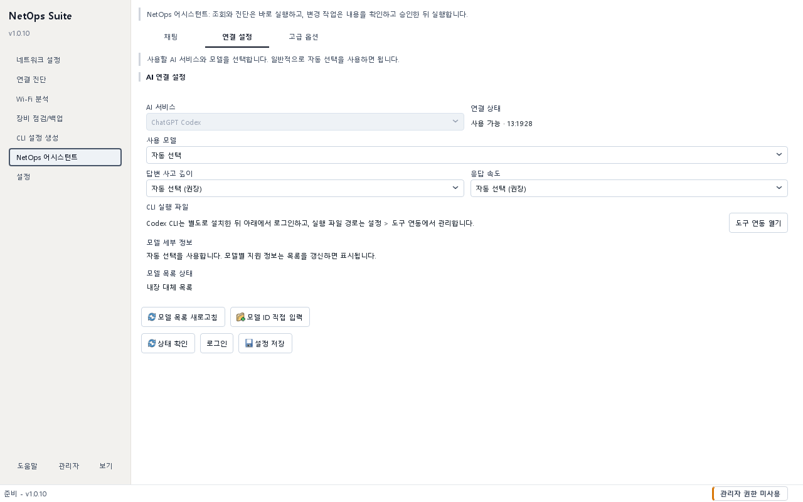

# NetOps 어시스턴트 가이드

## 목적 {#assistant}

ChatGPT Codex CLI를 NetOps Suite 안에서 사용해 대화하고, 필요한 경우 등록된 NetOps 조회·진단·변경 기능을 정책에 따라 실행합니다. 조회와 네트워크 진단은 바로 실행될 수 있고, 로컬·시스템 변경 또는 원격 연결은 명시적 승인 후 실행됩니다.

## 사전 준비 및 권한

- Codex CLI를 먼저 설치합니다. NetOps Suite는 이미 설치된 실행 파일을 재사용하며 자동으로 설치하거나 업데이트하지 않습니다.
- `설정 > 도구 연동 > AI CLI 실행 파일`에서 자동 감지 상태를 확인하고, 자동 감지가 실패할 때만 신뢰할 수 있는 실제 Codex 실행 파일 경로를 지정합니다.
- 로그인 화면이나 브라우저가 열리면 계정 선택, 동의와 MFA는 사용자가 직접 완료합니다. NetOps Suite가 이 단계를 대신 승인하지 않습니다.
- 프롬프트와 첨부 내용은 Codex CLI와 OpenAI 서비스로 전달될 수 있습니다. 조직의 데이터 반출 정책을 먼저 확인합니다.
- Codex는 기본 `읽기 전용` 권한을 권장합니다. 작업공간 쓰기나 전체 액세스는 요청에 실제로 필요할 때만 선택합니다.
- 시스템 변경 도구는 관리자 권한이 필요할 수 있으며, 원시 셸·PowerShell·SSH 명령 실행 도구는 NetOps 어시스턴트 정책에서 차단됩니다.

## 입력 및 선택 사항

- `AI 서비스`: ChatGPT Codex
- `연결 동작`: Codex CLI 설치·로그인 상태 확인과 `로그인`
- `사용 모델`: Codex에서 조회한 모델, 저장된 모델 목록 또는 직접 입력한 모델 ID
- `답변 사고 깊이`, `응답 속도`: 제공자가 지원하는 범위에서 적용
- Codex 권한:
  - `읽기 전용`: 파일을 읽을 수 있지만 변경하지 않음
  - `작업공간 액세스`: NetOps Suite의 설정·로그·결과·사용자 프로파일 작업공간 안에서 변경 가능
  - `전체 액세스`: 인터넷과 컴퓨터의 파일·명령에 넓게 접근 가능하며 별도 경고 승인 필요
- `파일 첨부`: 파일 선택, 끌어놓기 또는 클립보드 이미지 붙여넣기
- `고급 옵션`: CLI가 실제 제공하는 도움말에서 불러온 옵션만 선택해 적용

## 사용 방법

### 연결 준비

1. `설정 > 도구 연동 > AI CLI 실행 파일`에서 Codex CLI가 감지되는지 확인합니다.
2. 자동 감지에 실패하면 신뢰할 수 있는 Codex 실행 파일을 선택하고 `AI CLI 경로 저장`을 누릅니다.
3. `NetOps 어시스턴트 > 연결 설정`에서 `상태 확인`을 누릅니다.
4. 로그인이 필요하면 `로그인`을 누르고 공식 Codex CLI 화면에서 계정 선택, 동의와 MFA를 직접 완료합니다.
5. 로그인 완료 후 연결 상태와 모델 선택 목록을 다시 확인합니다. 목록에 없는 유효 모델은 `모델 ID 직접 입력`으로 지정할 수 있습니다.
6. 사고 깊이와 응답 속도를 선택하고 `설정 저장`을 누릅니다.

계정을 바꾸거나 로그아웃하려면 공식 Codex CLI에서 처리한 뒤 NetOps Suite의 연결 상태를 다시 확인합니다.

### 대화와 첨부

1. `채팅`에서 자연어 요청을 입력합니다.
2. 필요한 파일만 `파일 첨부`, 끌어놓기 또는 붙여넣기로 추가합니다. 첨부 미리보기에서 대상이 맞는지 확인합니다.
3. Codex를 사용할 때 권한 버튼이 `읽기 전용`인지 먼저 확인합니다.
4. Enter 또는 `보내기`로 실행하고, 줄바꿈은 Shift+Enter를 사용합니다.
5. 실행 중 취소하려면 `중지`를 누릅니다.
6. 각 답변은 메시지의 `복사`로 원문을 복사할 수 있습니다.

### NetOps 기능 실행

1. Ping, DNS, 인터페이스 조회, 파일 전송, 장비 점검처럼 원하는 작업과 대상을 구체적으로 요청합니다.
2. 앱은 외부 명령이나 스크립트를 제안하기 전에 등록된 NetOps 기능과 가이드를 먼저 찾습니다.
3. 일치하는 기능이 있으면 답변 아래의 `기능 열기` 또는 `가이드 열기`로 실제 화면과 절차를 확인합니다.
4. 내부 도구로 실행할 수 있는 요청은 도구 이름, 대상, 권한 등급과 영향을 표시합니다. 읽기·진단 작업은 바로 실행될 수 있습니다.
5. UI에서 수행하는 기능은 화면에 표시되는 한국어 명칭과 입력 절차를 안내합니다. 내부 코드나 화면에 없는 버튼은 사용 절차가 아닙니다.
6. 내부 기능이 요청의 일부만 지원하면 지원되는 범위와 제한을 먼저 표시합니다. 스크립트나 외부 절차는 사용자가 그 요청에서 `스크립트로 해줘`, `동의해`처럼 명확히 동의한 뒤에만 제안합니다.
   - `하지 마`, `하지 말아줘`, `동의하지 않아` 같은 거절·부정 표현은 동의로 처리되지 않습니다.
   - 동의는 해당 요청에 한 번만 적용되며 다음 요청으로 이어지지 않습니다.
7. 파일 쓰기, 시스템 변경, 원격 접속은 승인 창에서 대상과 인자를 확인한 경우에만 승인합니다.
8. 관리자 권한이 필요한 시스템 변경이 차단되면 실행 결과를 정리한 뒤 관리자 권한으로 앱을 다시 열고 요청을 재검토합니다.
9. 실행 결과와 뒤이은 AI 설명을 구분해 읽습니다. AI 설명이 실제 결과에 없는 성공을 주장하면 원본 도구 결과를 우선합니다.

### 고급 옵션

1. `고급 옵션 > 사용 가능한 기능 불러오기`를 누릅니다.
2. 한국어 설명과 주의사항을 읽고 기능과 필요 값을 선택합니다.
3. `선택한 기능 적용` 또는 `해제`를 사용합니다.
4. 승인 우회, 전체 권한 강제 같은 위험 옵션은 화면에서 제공하지 않습니다.
5. CLI 원문을 확인해야 할 때만 `CLI 도움말 원문 보기`를 펼칩니다.

### 세션과 내보내기

- `세션 초기화`는 화면의 대화 기록을 유지하면서 제공자 세션과 현재 활성 NetOps 기능 문맥을 함께 초기화합니다.
- `대화 내용 저장`은 현재 화면의 대화를 Markdown 파일로 저장합니다.
- 파일 검색, 도구 호출, 내부 추론 같은 진행 이벤트는 답변과 대화 내보내기에 포함되지 않습니다.
- 화면 기록 자체를 지우는 기능과 제공자 측 데이터 보존 정책은 별개입니다.

## 성공 확인

- 연결 상태에 Codex CLI 설치 여부와 로그인 상태가 표시됩니다. 실행 파일이 감지됐다는 사실만으로 로그인 완료가 확인되는 것은 아닙니다.
- 모델 목록 상태에 `실시간 모델 목록` 또는 `저장된 모델 목록`이 표시되고 선택한 모델명이 답변 제목에 나타납니다.
- Codex CLI가 사용 가능하고 다른 요청을 실행 중이지 않으면 전송 버튼을 사용할 수 있습니다. 채팅 중 로그인 오류가 발생하면 연결 상태의 안내에 따라 공식 Codex 로그인을 다시 완료합니다.
- 전송한 사용자 메시지와 응답이 시간과 함께 대화 화면에 표시됩니다.
- NetOps 기능을 실행했으면 시스템 메시지, 실제 실행 결과와 정책 상태가 표시됩니다.
- 변경·원격 연결 작업은 승인 전에는 실행되지 않고, 관리자 필수 작업은 일반 권한에서 차단됩니다.

## 결과 및 저장 위치

- 모델, Codex CLI 경로와 고급 옵션은 현재 설정 폴더의 앱 설정에 저장됩니다.
- 대화 내보내기는 기본적으로 결과/내보내기 폴더를 제안하며 `.md`로 저장됩니다.
- NetOps 도구 정책·실행 감사 기록은 현재 로그 폴더의 `netops_assistant_audit.jsonl`에 남습니다.
- 붙여넣은 이미지는 전송 준비를 위해 임시 파일로 만들어질 수 있으며 요청 종료·제거·앱 종료 시 정리됩니다.
- Codex 로그인 자격 정보와 제공자 측 대화 보관 위치는 공식 Codex CLI와 OpenAI 정책이 관리합니다. NetOps Suite는 토큰·인증 캐시 파일을 읽거나 앱 설정에 저장하지 않습니다.

## 주의사항

- AI 답변과 생성 명령은 검토 자료이며 운영 변경의 승인이나 검증을 대신하지 않습니다.
- Codex CLI는 조직이 승인한 공식 배포 방법으로 설치하고, 실행 파일 경로를 지정할 때 파일의 출처를 확인합니다.
- 내부 IP, 구성, 로그, 캡처, 자격 증명, 개인 정보가 포함된 프롬프트와 첨부를 외부 제공자에 보내지 마세요.
- 파일 첨부는 내용 일부가 잘리거나 바이너리 형식 때문에 문맥에 포함되지 않을 수 있습니다. 처리됐다고 추정하지 말고 답변을 확인합니다.
- Codex `전체 액세스`는 컴퓨터 전체 파일과 인터넷 접근 위험이 있습니다. 신뢰할 수 있고 범위가 명확한 요청에서만 일시적으로 사용한 뒤 낮춥니다.
- NetOps 도구 승인 창의 대상·포트·경로가 프롬프트 의도와 다르면 취소합니다.
- 스크립트나 외부 절차를 거절하려면 `하지 마`처럼 분명히 답하세요. 거절 문장은 동의 상태를 소비하거나 외부 대안을 허용하지 않습니다.
- `중지`는 실행 중 프로세스에 종료를 요청하지만 이미 완료된 파일·시스템·원격 변경을 되돌리지 않습니다.
- 대화 내보내기와 감사 로그도 민감 자료로 취급합니다.

## 문제 해결

- `CLI 없음`이면 조직이 승인한 공식 방법으로 Codex CLI를 설치한 뒤 `설정 > 도구 연동`에서 자동 감지를 다시 실행하거나 실제 실행 파일 경로를 저장합니다.
- 로그인이 반복되면 공식 Codex CLI에서 계정 선택·동의·MFA가 완료됐는지와 브라우저 팝업·프록시 차단 여부를 확인하고 `로그인`을 다시 누릅니다.
- Codex 모델 목록을 못 가져오면 CLI 버전·로그인·네트워크를 확인하고 기존 캐시 또는 `모델 ID 직접 입력`을 사용합니다.
- 요청이 실행되지 않으면 빈 프롬프트, 실행 중인 이전 요청, 권한 모드와 정책 차단 메시지를 확인합니다.
- 요청과 다른 기능이 추천되면 대상 기능명을 함께 입력하거나 `세션 초기화` 후 다시 요청합니다. 기능이 일부만 지원된다는 안내가 나오면 제한을 확인한 뒤 대안 제안 여부를 결정합니다.
- NetOps 변경이 차단되면 관리자 권한과 명시적 승인 필요 여부를 확인합니다. 차단을 우회하는 고급 인자를 추가하지 마세요.
- 첨부가 보이지 않으면 지원되는 읽기 가능한 파일인지, 파일이 존재하는지 확인하고 다시 첨부합니다.
- 응답이 없거나 스트리밍이 멈추면 `중지` 후 상태 확인을 실행하고 앱 로그와 CLI 자체 오류를 확인합니다.
