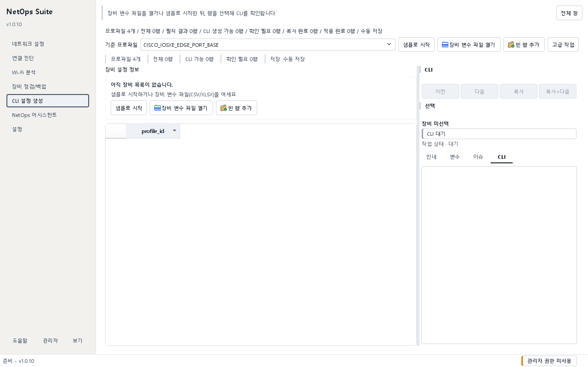

# CLI 설정 생성 가이드

## 목적 {#config-builder}

YAML 프로파일의 변수·검증 규칙·Jinja2 명령 블록과 CSV/XLSX 장비 값을 결합해 장비별 CLI를 미리 보고 저장합니다. 이 기능은 CLI 텍스트를 생성할 뿐 장비에 직접 접속하거나 설정을 적용하지 않습니다.

## 사전 준비 및 권한

- NetOps Suite 통합 앱의 왼쪽 메뉴에서 `CLI 설정 생성`을 엽니다. 예전 독립 실행 스크립트 안내는 현재 통합 앱 실행 방법이 아닙니다.
- 설치본은 시작 메뉴의 NetOps Suite를 사용합니다. 소스 환경은 프로젝트 루트에서 `.\scripts\run_dev.ps1`을 실행합니다.
- 처음에는 내장 샘플 프로파일과 장비 값을 사용하고, 운영용 프로파일은 장비 모델·OS·버전에 맞게 검토합니다.
- 생성 CLI를 장비에 붙여넣을 권한과 변경 절차는 앱 밖에서 별도로 승인받아야 합니다.

## 입력 및 선택 사항

- 프로파일: YAML 파일이며 고유 `id`, 제조사, 모델, 펌웨어, 변수 정의와 명령 블록을 가집니다.
- 장비 값: CSV 또는 XLSX이며 `profile_id` 열이 필수입니다. `device_id`는 식별 편의를 위한 선택 열입니다.
- 각 프로파일 변수는 필수 여부, 기본값, 자료형과 `suffix_number` 또는 `ipv4` 연속 값 규칙을 가질 수 있습니다.
- 명령 블록은 화면에서 켜거나 꺼 전체 장비 렌더링에 반영합니다.
- 비밀로 판단되는 열 이름(`secret`, `password`, `community`, `passphrase`, `token`, `key`)은 일부 안내에서 마스킹되지만 원본 파일과 생성 CLI에는 실제 값이 남을 수 있습니다.

첫 학습에는 다음 내장 예시를 사용합니다.

- 프로파일: `sample_comprehensive_reference.yaml`
- 장비 값: `sample_comprehensive_reference_devices.csv`

## 사용 방법

### 샘플로 첫 CLI 만들기

1. `CLI 설정 생성`을 열고 `샘플로 시작`을 누릅니다.
2. 기준 프로파일과 불러온 장비 행을 확인합니다.
3. 장비 행 하나를 선택합니다.
4. 오른쪽 `안내`와 변수 요약을 읽고 `이슈`에 오류가 없는지 확인합니다.
5. `CLI` 탭에서 생성 결과를 확인합니다.
6. `복사`로 현재 장비 CLI를 클립보드에 복사하거나 `복사+다음`으로 다음 행까지 순서대로 작업합니다.
7. 실제 적용을 별도 절차에서 완료한 뒤에만 `적용 완료`로 상태를 표시합니다. 이 버튼 자체가 장비에 CLI를 전송하지는 않습니다.

### 장비 값 파일 열기와 편집

1. `장비 변수 파일 열기` 또는 `데이터 열기`에서 `.csv`나 `.xlsx`를 선택합니다.
2. 각 행의 `profile_id`가 실제 프로파일 ID와 맞는지 확인합니다.
3. 표에서 hostname, 관리 IP, 마스크, 게이트웨이, VLAN 등 필요한 값을 수정합니다.
4. `이슈` 탭에서 필수값 누락, 형식 오류, 중복 hostname/IP, 게이트웨이 대역 불일치를 해결합니다.
5. 특정 장비를 찾을 때는 필터 열과 값을 사용하고, 표시 컬럼·고정 기능으로 작업 열을 정리합니다.
6. 명령 블록 선택을 바꾸면 해당 블록이 전체 CLI에서 포함 또는 제외됩니다.

### 행 복사와 연속 값

- `선택 행 복사`는 값을 그대로 복제하므로 hostname과 IP처럼 고유해야 하는 값은 직접 바꿉니다.
- `연속 값 복사`는 프로파일에서 `auto_increment`가 지정된 변수만 증가시킵니다.
- `device_id`는 자동 증가 규칙이 정의되지 않았다면 직접 고유하게 수정합니다.

### 프로파일 작성

1. `고급 작업` 또는 `전체 창`을 열고 `새 프로파일`, `프로파일 복사`, `프로파일 편집` 중 하나를 선택합니다.
2. 프로파일 ID, 제조사·모델·펌웨어와 설명을 입력합니다.
3. 변수 이름, 자료형, 필수값, 기본값, 연속 값 규칙을 정의합니다.
4. 명령 블록에 `hostname {{ hostname }}`처럼 변수를 참조하는 CLI 줄을 작성합니다.
5. 미리보기와 오류를 확인하고 저장합니다.
6. 장비 값 파일의 `profile_id`와 새 프로파일 ID를 일치시켜 렌더링합니다.

### 저장과 내보내기

- 장비 값은 `다른 이름으로 저장`으로 CSV/XLSX에 저장합니다.
- `실시간 파일 저장`은 열린 원본 파일에 편집 내용을 반영합니다. 오류 행이 있으면 기본적으로 자동 저장을 보류합니다.
- `오류 있어도 실시간 저장`은 오류를 포함한 파일 저장이 꼭 필요할 때만 켭니다.
- 생성 CLI는 현재 선택 장비 TXT, 모든 장비 묶음 TXT, 장비별 TXT가 든 ZIP으로 저장할 수 있습니다.

## 성공 확인

- 상단 요약에서 전체 행 수와 `CLI 생성 가능` 행 수가 기대와 일치합니다.
- 선택 장비 상태가 `복사 가능`이고 오류 수가 0입니다.
- CLI 미리보기의 모든 `{{ ... }}`가 실제 값으로 치환됐고 불필요한 블록이 제외됐습니다.
- hostname, 관리 IP, VLAN, 인터페이스와 기본값을 원본 설계 문서와 대조합니다.
- 내보낸 TXT 또는 ZIP을 다시 열어 장비별 구분과 줄바꿈, 문자 인코딩을 확인합니다.

## 결과 및 저장 위치

- 사용자 프로파일은 기본적으로 `%LOCALAPPDATA%\NetOps Suite\config_builder\profiles` 아래에 준비됩니다. 처음 실행 시 번들 샘플이 사용자 프로파일 폴더에 복사될 수 있습니다.
- 샘플로 시작한 장비 값은 데이터 루트의 `config_builder\device_values` 아래에 준비될 수 있습니다.
- CLI 저장 대화상자의 기본 제안 위치는 현재 결과/내보내기 폴더이며 최종 위치는 사용자가 선택합니다.
- 기존 장비 값 파일을 저장할 때 프로그램이 백업 사본을 만들 수 있지만, 운영 원본의 별도 버전 관리와 백업을 대신하지 않습니다.
- 정확한 현재 결과/내보내기 경로는 `설정 > 저장 위치`에서 확인합니다.

## 주의사항

- 내장 샘플은 데이터 구조와 화면 사용법을 보여주는 참고 자료이며 운영 명령의 정답이 아닙니다.
- 생성 성공은 CLI의 업무 적합성, 장비 호환성 또는 변경 안전성을 보장하지 않습니다.
- 실시간 저장은 열린 장비 파일을 직접 변경합니다. 샘플이나 원본을 보존하려면 먼저 별도 파일로 저장하세요.
- `오류 있어도 실시간 저장`을 켜면 불완전한 값이 파일에 남습니다.
- 비밀값이 있는 장비 파일, CLI, ZIP과 클립보드 내용은 운영 민감 자료로 취급합니다.
- 블록 선택은 현재 렌더링 전체에 영향을 줄 수 있으므로 내보내기 직전에 다시 확인합니다.
- `적용 완료` 상태는 작업 추적 표시일 뿐 장비의 실제 상태를 검증하지 않습니다.

## 문제 해결

- 프로파일을 찾지 못하면 `profile_id`의 공백과 철자, 프로파일 저장 여부를 확인하고 `새로고침`합니다.
- CLI가 비어 있으면 선택 장비의 `이슈`와 필수 변수, 선택된 명령 블록을 확인합니다.
- 자료형 오류는 IPv4, 정수, bool 등 프로파일이 요구하는 형식으로 값을 수정합니다.
- 중복 경고는 hostname 또는 IP가 다른 행과 겹치는지 확인합니다.
- 게이트웨이 경고는 관리 IP·마스크·게이트웨이가 같은 네트워크인지 확인합니다.
- 실시간 저장이 되지 않으면 파일이 읽기 전용인지, 다른 프로그램이 잠갔는지, 오류 행 때문에 보류됐는지 확인합니다.
- 프로파일 수정 후 결과가 그대로면 프로파일 목록을 새로고침하고 장비 행을 다시 선택합니다.
