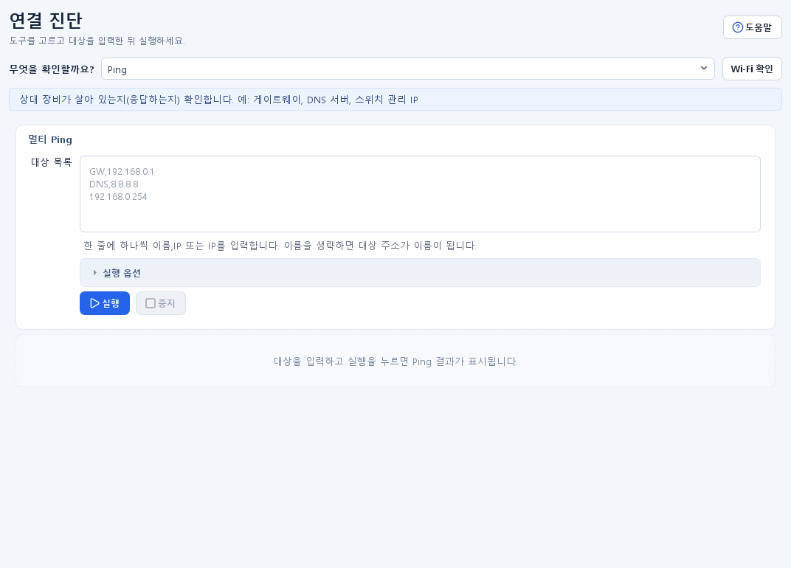

# 연결 진단 가이드

## 목적 {#diagnostics}

상단 `무엇을 확인할까요?`에서 도구를 고르면 그 아래에 도구가 하는 일이 쉬운 말로 표시됩니다. 대상을 입력하고 실행한 뒤 결과를 확인하는 순서로 연결 문제의 범위를 좁힙니다.



포함 도구는 Ping, 포트 확인(TCPing), DNS 조회, 경로 추적, iperf3, ARP 스캔, 서브넷 계산기, OUI 조회, 명령 출력입니다. Wi-Fi는 같은 메뉴의 `Wi-Fi 확인`에서 확인합니다. 파일 전송은 왼쪽 `파일 전송` 화면으로 이동했으며 별도의 [파일 전송 가이드](transfer.md)에서 설명합니다.

## 사전 준비 및 권한

- 대부분의 조회와 진단은 일반 권한에서 실행됩니다.
- DNS 캐시 비우기는 Windows 환경에 따라 관리자 권한이 필요할 수 있습니다.
- 방화벽, ACL, ICMP 차단, 프록시 또는 보안 솔루션 때문에 실패 결과가 실제 서비스 장애와 다를 수 있습니다.
- ARP 스캔은 승인된 로컬 IPv4 대역에서만 사용합니다. 한 번에 1,024호스트 이하만 허용됩니다.
- iperf3는 측정하는 두 끝점 중 하나에 서버가 실행 중이어야 하며, 앱이 `iperf3.exe`를 찾을 수 있어야 합니다.

## 입력 및 선택 사항

- 상단 `무엇을 확인할까요?`에서 도구를 고르면 해당 도구의 대상 입력란이 표시됩니다. IP·호스트 이름·CIDR 등 화면이 요구하는 형식을 사용합니다.
- 여러 Ping/TCPing 대상은 한 줄에 하나씩 `이름,주소` 또는 `주소` 형식으로 입력합니다.
- TCP 포트는 쉼표·공백·세미콜론 목록 또는 `8000-8010` 같은 범위로 입력합니다.
- 문서 예시에는 `192.0.2.10`, `192.0.2.0/24`, `router.example.test`처럼 예약된 값을 사용합니다. 실제 실행 시에는 승인된 대상만 사용하세요.
- 빈 횟수·시간 입력은 화면의 기본값을 사용합니다. Ping은 횟수 4·Timeout 4000ms, TCPing은 횟수 4·Timeout 1000ms, ARP는 Timeout 800ms·동시 실행 64가 기본입니다.

## 사용 방법

### 진단 시작

1. 상단 `무엇을 확인할까요?`에서 Ping, 포트 확인, DNS 조회 등 필요한 도구를 고르고 아래 설명으로 맞는 도구인지 확인합니다.
2. 표시된 대상 입력란에 주소를 입력합니다. 포트가 필요한 도구에서는 포트도 확인합니다.
3. `실행`을 누르고 현재 화면에서 결과를 확인합니다.
4. 횟수·Timeout·DNS 서버·측정 조건을 바꾸려면 `실행 옵션`을 펼칩니다. 접어도 입력값은 유지됩니다.
5. Ping과 포트 확인의 추가 결과 컬럼은 `상세 열`, 원문은 `원문 로그`를 펼쳐 확인합니다.

### 멀티 Ping {#ping}

1. 대상 목록에 다음처럼 한 줄씩 입력합니다.

   ```text
   테스트-라우터,192.0.2.1
   192.0.2.10
   ```

2. 횟수와 Timeout을 입력하거나 비워 기본값을 사용합니다.
3. 끝날 때까지 반복하려면 `계속 실행 (-t)`을 선택합니다. 이때 횟수는 사용하지 않습니다.
4. `실행`을 누르고 이름·대상별 전송, 수신, 실패, 손실률, 최소/평균/최대 RTT를 확인합니다.
5. 연속 실행은 반드시 `중지`로 종료합니다.
6. 전체 표는 분리된 Ping 결과 창의 `CSV 저장`, 선택한 행의 원문은 `로그 저장`으로 보관합니다.

### 포트 확인(TCPing) {#tcp}

1. 대상 목록을 Ping과 같은 형식으로 입력합니다.
2. 포트에 `22,80,443` 또는 `8000-8010`처럼 입력합니다.
3. 횟수·Timeout 또는 `계속 실행 (-t)`을 선택하고 `실행`합니다.
4. 앱은 모든 `대상 × 포트` 조합을 확인합니다. 상태, 성공·실패, 손실률, 지연 시간을 비교합니다.
5. 전체 결과는 CSV, 선택한 조합의 상세 기록은 로그로 저장할 수 있습니다.

### DNS 조회(nslookup) {#dns}

1. 도메인 또는 역조회할 IP를 입력합니다.
2. 레코드 타입을 선택합니다.
   - `A`: IPv4 주소
   - `AAAA`: IPv6 주소
   - `CNAME`: 별칭
   - `MX`: 메일 서버
   - `PTR`: IP의 역방향 이름
3. 특정 DNS 서버를 쓰려면 `DNS 서버`에 주소를 입력하고, 시스템 기본 서버를 쓰려면 비워 둡니다.
4. `조회`를 누른 뒤 원본 nslookup 출력과 상태를 확인합니다.
5. 결과가 있을 때 `TXT 저장`으로 보관합니다.

### 경로 추적(tracert/pathping) {#trace}

1. 대상 IP 또는 호스트 이름을 입력합니다.
2. 이름 역조회 시간을 줄이려면 `호스트 이름 해석 안 함 (-d / -n)`을 선택합니다.
3. 빠른 홉 경로는 `tracert`, 홉별 손실률은 `pathping`을 누릅니다.
4. 홉 표와 아래 원본 명령 출력을 함께 확인합니다. `pathping`은 수 분 걸릴 수 있습니다.
5. 오래 걸리거나 대상이 잘못되었으면 `중지`를 누릅니다.

### 대역폭 측정(iperf3) {#iperf}

1. 상태가 `iperf3 설치 필요`이면 `설정에서 관리`를 눌러 설치·경로 상태를 확인합니다.
2. 클라이언트 모드에서는 승인된 iperf3 서버 주소, 포트(기본 5201), 스트림(기본 1), 지속 시간(기본 10초)을 입력합니다.
3. 필요할 때만 `Reverse (-R)`, `UDP (-u)`, `IPv6 (-6)`를 선택합니다.
4. 공개 서버를 사용할 때는 `공개 서버 사용 > 갱신` 후 지역과 서버를 선택합니다. 서버별 지원 옵션에 따라 체크 상자가 제한됩니다.
5. 서버 모드에서는 포트와 IPv4/IPv6를 확인하고 `시작`합니다. 앱은 `0.0.0.0:<포트>` 또는 `[::]:<포트>`로 모든 해당 인터페이스에서 수신합니다.
6. 출력에서 전송량, 비트율, 재전송 또는 지터·손실을 확인하고 작업이 끝나면 서버도 `중지`합니다.

### 같은 대역 장비 찾기(ARP 스캔) {#arp}

1. `목록`으로 현재 어댑터의 후보 서브넷을 불러오고 `자동 입력`하거나 승인된 IPv4 CIDR을 직접 입력합니다.
2. Timeout과 동시 실행 수를 확인합니다. 동시 실행 수가 높을수록 대상과 로컬 PC의 부하가 커질 수 있습니다.
3. `스캔`을 누르고 영향 확인 창을 승인합니다.
4. IP, MAC, 제조사, 응답, ARP 타입, 어댑터와 감지 상태를 확인합니다.
5. 같은 MAC이 여러 IP에 보이거나 이전 스캔과 IP의 MAC이 달라지면 `중복 MAC` 또는 `IP 충돌 의심`으로 표시됩니다. 이 표시는 조사 단서이며 단독 확정 판정은 아닙니다.

### 서브넷 계산기 {#subnet}

1. IPv4와 프리픽스 또는 서브넷 마스크를 입력합니다.
2. 현재 어댑터 값을 쓰려면 `목록 > 자동 입력`을 사용합니다.
3. `계산`을 누릅니다. 이 작업은 패킷을 보내지 않습니다.
4. 네트워크 주소, 사용 가능 범위, 브로드캐스트, 호스트 수와 상세 주소 유형을 확인합니다.

### MAC 제조사 조회(OUI) {#oui}

1. MAC 주소를 한 줄에 하나씩 입력합니다. `이름,MAC`, 콜론·하이픈·점·공백 구분 형식을 사용할 수 있습니다.
2. `조회`를 눌러 정규화된 MAC, 제조사, 일치 상태를 확인합니다.
3. 제조사 정보가 오래됐거나 없으면 `OUI 갱신`을 눌러 IEEE 원본 기반 로컬 캐시를 갱신합니다.

### 명령 출력 {#commands}

1. `무엇을 확인할까요?`에서 `명령 출력`을 선택합니다.
2. `명령`에서 공인 IP, 인터페이스, ipconfig, route, arp 또는 DNS 캐시 작업을 고릅니다.
3. `실행`을 누르고 출력 내용을 확인합니다.
4. 필요한 출력만 저장합니다. DNS 캐시 비우기는 영향 확인과 필요한 권한 확인 후 실행합니다.

공인 IP 조회는 외부 서비스에 접속합니다. DNS 캐시 비우기는 현재 PC의 이름 해석 캐시를 변경하며 다른 진단 조회와 다릅니다.

## 성공 확인

- Ping은 각 대상의 전송·수신 수와 손실률이 갱신됩니다.
- TCPing은 각 대상·포트 조합이 별도 행으로 표시됩니다. `실패`는 서비스 중지, 방화벽 차단, 경로 문제를 구분하지 않으므로 다른 진단과 함께 해석합니다.
- DNS는 요청한 레코드 타입의 nslookup 원본 또는 명확한 실패 메시지를 표시합니다.
- 경로 추적은 홉 표와 원본 출력이 채워집니다. 별표가 있는 홉은 ICMP 응답 제한일 수 있습니다.
- iperf3는 양쪽에 일치하는 포트가 열려 있을 때 측정 출력이 끝까지 표시됩니다.
- ARP·OUI 결과는 MAC이 확인된 경우 제조사 캐시와 함께 표시됩니다.

## 결과 및 저장 위치

- Ping/TCPing 전체 결과 CSV, 선택 로그, DNS TXT는 저장 창을 열 때 기본 결과/내보내기 폴더를 제안합니다.
- CSV는 Excel에서 한글이 깨지지 않도록 UTF-8 BOM 형식으로 저장됩니다.
- 실제 저장 위치는 저장 대화상자에서 선택한 경로입니다.
- ARP, OUI, 경로 추적, 명령 출력, iperf3 결과는 기본적으로 화면에 표시되며 자동 파일 저장되지 않습니다. 필요한 원문은 승인된 위치에 별도로 기록하세요.
- OUI 캐시와 공개 iperf3 서버 캐시는 현재 설정 폴더에 저장됩니다.

## 주의사항

- 진단 성공은 애플리케이션 전체의 정상 동작을 보장하지 않고, 실패도 항상 장애를 뜻하지 않습니다.
- 연속 Ping/TCPing과 큰 포트 범위는 오래 실행되며 결과와 로그가 계속 늘어날 수 있습니다.
- ARP 스캔은 보안 장비에 탐지될 수 있고 승인되지 않은 대역 스캔은 금지될 수 있습니다.
- 공개 iperf3 서버는 외부 운영 주체의 자원입니다. 서버 정책과 지원 옵션을 확인하고 민감한 네트워크 정보가 노출되지 않게 하세요.
- iperf3 서버 모드는 모든 인터페이스에 포트를 열 수 있습니다. Windows 방화벽과 네트워크 경계를 확인하고 측정 직후 중지하세요.
- 공인 IP와 OUI/공개 서버 갱신은 외부 네트워크 요청을 사용합니다.

## 문제 해결

- Ping만 실패하면 대상의 ICMP 차단 가능성을 확인하고 TCPing 또는 실제 서비스 접속 결과와 비교합니다.
- TCPing이 모두 실패하면 주소·포트 입력, 서버 대기 상태, 로컬·원격 방화벽과 라우팅을 확인합니다.
- DNS 기본 서버만 실패하면 특정 승인 DNS 서버를 입력해 비교하고, 캐시 비우기는 마지막 단계에서 수행합니다.
- `pathping`이 오래 걸리면 정상 동작일 수 있습니다. 즉시 경로만 필요하면 `tracert`를 사용합니다.
- iperf3를 찾지 못하면 `설정 > 도구 연동`에서 프로그램 폴더, winget 설치, 시스템 PATH 순의 감지 결과를 확인합니다.
- ARP 스캔에서 1,024호스트 제한 오류가 나오면 대역을 더 작은 CIDR로 나눕니다.
- OUI 제조사가 없으면 먼저 데이터 상태와 업데이트를 확인합니다. 임의·로컬 관리 MAC은 제조사가 없을 수 있습니다.

## 연결 진단 빠른 안내 {#quick-diagnostics}

연결 문제의 범위를 좁힙니다.

**준비**: 조직에서 확인을 허용한 장비 주소를 준비합니다.

1. `무엇을 확인할까요?`에서 도구를 고르고 아래 설명을 읽습니다.
2. 해당 도구의 대상을 입력하고 실행·조회·시작 등 표시된 동작 버튼을 누릅니다.
3. 결과를 확인하고 필요하면 포트 확인이나 DNS 조회로 이동합니다.

**성공 확인**: 실행 결과에 대상과 응답 또는 실패 원인이 표시됩니다.

**안 되면**: 응답 없음만으로 장비 고장을 단정하지 말고 주소와 방화벽을 확인합니다.

## 멀티 Ping 빠른 안내 {#quick-diagnostics-ping}

대상이 응답하는지 확인합니다.

**준비**: 확인할 IP 또는 호스트 이름을 준비합니다.

1. 대상 주소를 한 줄에 하나씩 입력합니다.
2. 실행을 누릅니다. 횟수·Timeout·계속 실행은 실행 옵션에서 바꿉니다.
3. 응답 시간과 손실률을 확인하고 연속 실행은 중지합니다.

**성공 확인**: 대상별 응답 시간과 손실률이 표시됩니다.

**안 되면**: 응답이 없으면 주소·연결·ICMP 허용 여부를 확인합니다.

## 포트 확인 (TCPing) 빠른 안내 {#quick-diagnostics-tcp}

장비의 특정 서비스 포트에 연결되는지 확인합니다.

**준비**: 대상 주소와 서비스의 TCP 포트 번호를 준비합니다.

1. 대상과 포트를 입력합니다.
2. 실행을 누릅니다. 횟수·Timeout·계속 실행은 실행 옵션에서 바꿉니다.
3. 대상별 연결 결과를 확인하고 연속 실행은 중지합니다.

**성공 확인**: 포트 연결 성공 또는 실패가 표시됩니다.

**안 되면**: 실패하면 서비스 실행 상태와 방화벽 허용 포트를 확인합니다.

## DNS 조회 (nslookup) 빠른 안내 {#quick-diagnostics-dns}

이름에 연결된 IP 또는 DNS 레코드를 확인합니다.

**준비**: 조회할 도메인과 필요할 경우 DNS 서버를 준비합니다.

1. 도메인을 입력합니다.
2. 레코드 유형을 고르고 조회를 누릅니다. DNS 서버 변경은 실행 옵션에서 합니다.
3. 조회한 값과 사용한 DNS 서버를 확인합니다.

**성공 확인**: 요청한 레코드 또는 명확한 조회 오류가 표시됩니다.

**안 되면**: 이름 철자와 DNS 서버 접근 여부를 확인합니다. 캐시 비우기는 별도 변경 작업입니다.

## 경로 추적 (tracert/pathping) 빠른 안내 {#quick-diagnostics-trace}

대상까지 이동하는 네트워크 경로를 확인합니다.

**준비**: 승인된 대상 주소를 준비합니다.

1. 대상을 입력합니다.
2. tracert 또는 pathping을 누릅니다. 이름 해석 여부는 실행 옵션에서 바꿉니다.
3. 각 홉의 주소와 응답 시간을 비교합니다.

**성공 확인**: 대상 또는 마지막 응답 지점까지의 홉이 표시됩니다.

**안 되면**: 중간 홉의 별표만으로 장애를 단정하지 말고 최종 대상 응답도 확인합니다.

## 대역폭 측정 (iperf3) 빠른 안내 {#quick-diagnostics-iperf}

두 장비 사이의 실제 전송 대역폭을 측정합니다.

**준비**: iperf3와 측정 상대 서버, 트래픽 발생 승인을 준비합니다.

1. 클라이언트 또는 서버 역할을 고릅니다.
2. 대상·포트를 확인합니다. 측정 시간 등은 실행 옵션에서 바꿉니다.
3. 시작을 누르고 완료된 속도를 확인합니다.

**성공 확인**: 측정 구간의 처리량이 표시됩니다.

**안 되면**: 시작이 비활성화되어 있으면 설정에서 관리로 iperf3 준비 상태를 확인합니다. 연결 실패 시 상대 서버와 포트를 확인합니다.

## 같은 대역 장비 찾기 (ARP 스캔) 빠른 안내 {#quick-diagnostics-arp}

같은 네트워크 대역의 장비를 찾습니다.

**준비**: 스캔이 허용된 로컬 IPv4 대역을 준비합니다.

1. 검색할 대역을 입력합니다.
2. 스캔을 실행합니다.
3. 검색된 IP·MAC과 제조사를 확인합니다.

**성공 확인**: 검색된 장비가 표에 표시됩니다.

**안 되면**: 0개면 PC의 현재 대역과 허용 범위를 확인합니다. 응답하지 않는 장비는 누락될 수 있습니다.

## 서브넷 계산기 빠른 안내 {#quick-diagnostics-subnet}

IP 주소가 속한 네트워크 범위를 계산합니다.

**준비**: IP 주소와 프리픽스 길이를 준비합니다. 네트워크 연결은 필요하지 않습니다.

1. IP 주소를 입력합니다.
2. 프리픽스를 입력합니다.
3. 계산을 누르고 네트워크·브로드캐스트·주소 범위를 확인합니다.

**성공 확인**: 192.0.2.10과 24를 입력하면 192.0.2.0/24가 표시됩니다.

**안 되면**: 계산되지 않으면 IPv4 형식과 프리픽스 범위를 확인합니다.

## MAC 제조사 조회 (OUI) 빠른 안내 {#quick-diagnostics-oui}

MAC 주소의 등록 제조사를 조회합니다.

**준비**: 확인할 MAC 주소를 준비합니다.

1. MAC 주소를 입력합니다.
2. 조회를 실행합니다.
3. 제조사 이름과 조회되지 않은 항목을 확인합니다.

**성공 확인**: 등록된 접두어에 해당하는 제조사가 표시됩니다.

**안 되면**: 조회가 없으면 주소 형식과 OUI 데이터 상태를 확인합니다. 임의 MAC은 미등록일 수 있습니다.

## 명령 출력 빠른 안내 {#quick-diagnostics-commands}

현재 PC의 네트워크 정보를 확인합니다.

**준비**: 조회하려는 정보의 종류를 선택합니다.

1. IP 구성·라우팅·ARP 등 필요한 조회를 고릅니다.
2. 명령 실행 후 출력 내용을 확인합니다.
3. 필요하면 결과를 저장합니다.

**성공 확인**: 선택한 정보가 출력 영역에 표시됩니다.

**안 되면**: 실행 오류가 나면 오류 문구와 앱 로그를 확인합니다.
