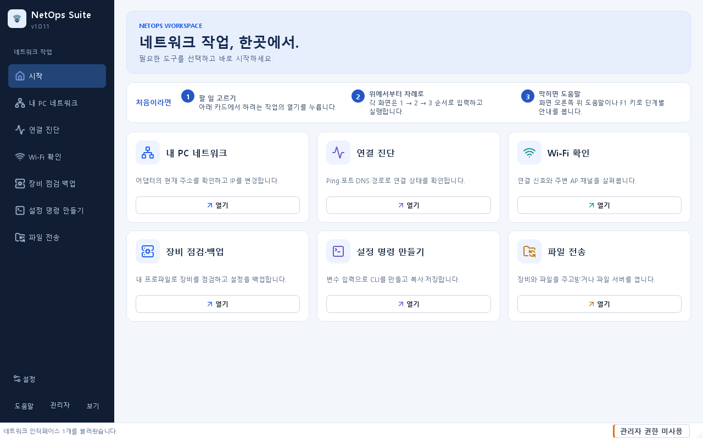
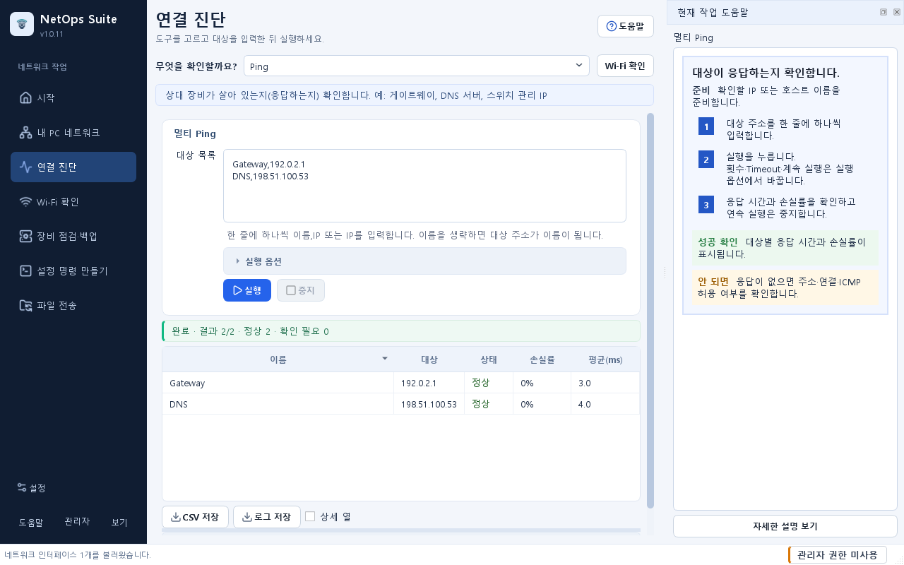

# 시작

## 목적 {#overview}

하려는 작업을 선택해 해당 화면을 여는 곳입니다. 현재 주소 확인, 연결 진단, 장비 점검, 명령 파일 작성과 파일 전송 중 필요한 작업을 고릅니다.

## 사전 준비 및 권한

앱을 처음 열 때는 일반 권한이면 충분합니다. 실제 장비에 접속하려면 승인된 대상 주소와 계정을 준비합니다. IP 설정 변경이 필요할 때만 관리자 권한으로 다시 실행합니다.

## 입력 및 선택 사항

- 연결 문제 확인: `연결 진단`에서 대상 주소를 입력합니다.
- PC의 IP 변경: `내 PC 네트워크`에서 어댑터를 선택합니다.
- 여러 장비 점검: `장비 점검·백업`에서 Excel 목록을 선택합니다.
- 장비 설정 명령 만들기: `설정 명령 만들기`에서 샘플이나 장비 값 파일을 엽니다.
- 파일 보내기·받기: `파일 전송`을 엽니다.

## 사용 방법

1. `시작`의 `처음이라면` 줄에서 사용 순서를 확인하고, 아래 카드에서 해보려는 작업의 `열기`를 누릅니다.
2. 열린 화면에서 대상 주소, 어댑터 또는 파일 등 필수 항목을 선택합니다.
3. 실행 옵션이나 상세 정보는 필요한 경우 제목을 눌러 펼칩니다. 내용이 길면 작업영역을 아래로 스크롤합니다.
4. 실행 버튼을 누른 뒤 화면의 완료 상태와 결과를 확인합니다. 실제 설정 변경이나 전송은 대상을 먼저 확인합니다.
5. 입력이 어렵다면 화면 오른쪽 위의 `도움말` 버튼이나 `F1`을 누릅니다. 오른쪽에 그림과 번호가 붙은 단계, 성공 확인, 안 될 때 할 일이 카드로 열립니다. 더 알아보려면 `자세한 설명 보기`를 누릅니다. 전체 도움말은 `따라 하기`(단계와 화면 그림)와 `자세한 설명`으로 나뉘며, 그림을 누르면 원래 크기로 크게 볼 수 있습니다.

작업 영역은 제목을 테두리 안쪽에 둔 카드로 구분합니다. 카드 제목 아래의 입력부터 확인하고, 보조 설명이나 옵션은 필요한 경우 펼칩니다.

## 성공 확인

선택한 작업의 결과나 완료 상태가 표시되는지 확인합니다. 진단은 응답과 오류, 장비 작업은 검증·실행 결과, 파일 전송은 완료된 파일을 확인합니다.

실제 대상을 사용하기 전에 화면을 익히려면 `설정 명령 만들기 > 샘플로 시작`에서 장비 행과 명령 미리보기를 확인할 수 있습니다. 샘플은 장비에 명령을 전송하지 않습니다. `연결 진단`의 서브넷 계산기에 `192.0.2.10`과 `24`를 넣어 `192.0.2.0/24`를 확인하는 방법도 있습니다.

## 결과 및 저장 위치

현재 화면에서 결과를 먼저 확인합니다. 파일로 남길 때는 해당 작업의 저장 버튼에서 경로를 선택합니다. 기본 저장 위치는 `설정 > 저장 위치`에서 확인할 수 있습니다. Wi-Fi 조회는 자동으로 결과 파일을 만들지 않습니다.

## 주의사항

실제 설정 변경·장비 명령·파일 전송·임시 서버 시작은 대상과 영향을 확인한 뒤 실행합니다. `192.0.2.10` 등 샘플 주소는 실습용이므로 연결 시험에는 승인된 실제 주소를 사용하세요. 결과 파일을 공유할 때는 주소·계정·설정 내용이 포함되었는지 확인합니다.

## 문제 해결

입력값에 오류가 있으면 표시된 항목부터 수정합니다. 버튼이 비활성화되어 있다면 대상 선택, 필수 입력 또는 필요한 권한을 확인합니다. 상세한 원인은 [문제 해결](troubleshooting.md)과 [설정](settings.md)에서 확인합니다.

## 시작 빠른 안내 {#quick-getting-started}

첫 작업을 고르고 결과를 확인합니다.

**준비**: 하려는 작업에 필요한 대상 주소, 계정 또는 파일을 준비합니다.

1. 시작에서 원하는 작업을 고릅니다.
2. 열린 화면에서 필수 항목을 입력하거나 선택합니다.
3. 대상을 확인하고 실행한 뒤 결과를 확인합니다.

**성공 확인**: 선택한 작업의 결과나 완료 상태가 보입니다.

**안 되면**: 필수 입력과 버튼 옆 안내를 확인합니다. 화면 오른쪽 위 `도움말`이나 F1로 단계별 안내를 엽니다.
