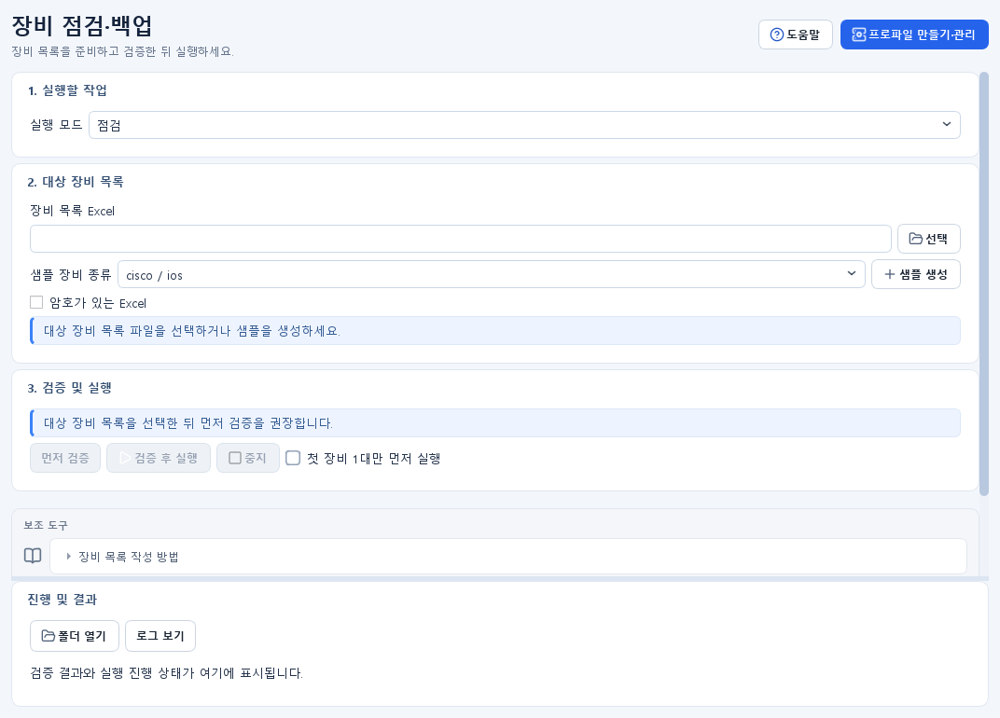
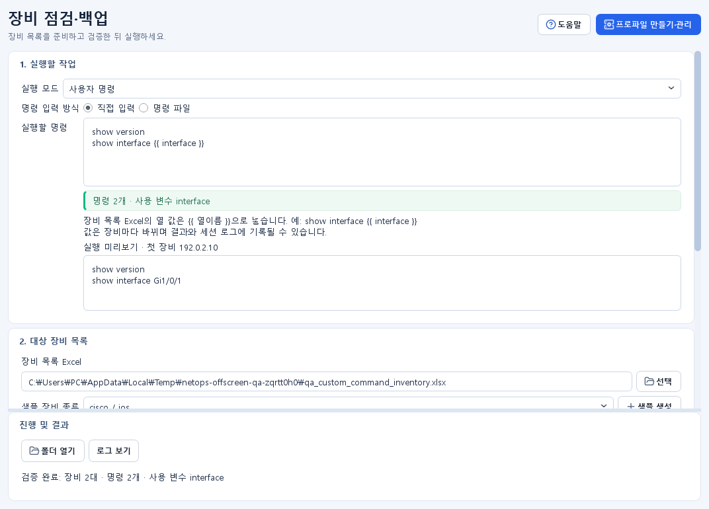
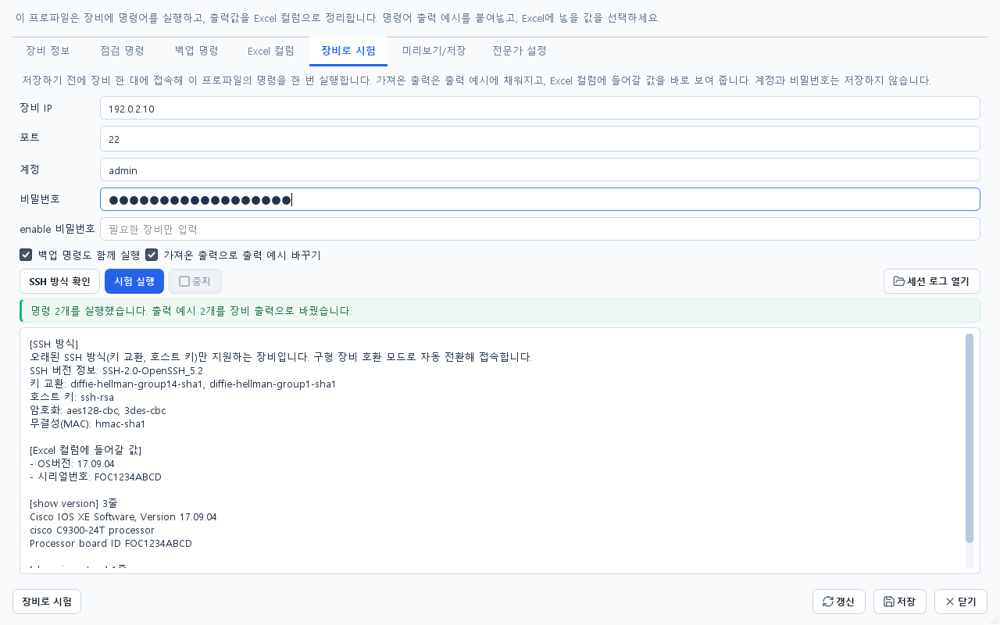

# 장비 점검·백업 가이드

## 목적 {#inspector}

Excel 장비 목록에 있는 여러 장비에 SSH 또는 Telnet으로 접속해 점검 명령, 설정 백업 또는 직접 입력한 명령을 한 번에 실행합니다. 장비별 결과 Excel, 백업 파일과 세션 로그가 남습니다.



## 사전 준비 및 권한

- 장비 접속과 명령 실행에 대한 조직 승인이 필요합니다.
- 장비 목록은 `.xlsx`, `.xls`, `.xlsm` Excel 파일입니다. 처음이면 화면의 `샘플 생성`으로 만듭니다.
- 지원하지 않는 장비는 화면 상단의 `프로파일 만들기·관리`에서 프로파일을 먼저 만듭니다.

## 입력 및 선택 사항

화면은 위에서 아래로 `1. 실행할 작업` → `2. 대상 장비 목록` → `3. 검증 및 실행` 순서입니다.

| 실행 모드 | 하는 일 |
| --- | --- |
| `점검` | 프로파일의 점검 명령을 실행하고 결과를 Excel 열로 정리 |
| `백업` | 프로파일의 백업 명령으로 설정을 파일로 저장 |
| `점검+백업` | 두 작업을 함께 실행 |
| `사용자 명령` | 직접 입력하거나 파일로 준 명령을 장비마다 실행 |

장비 목록 Excel의 열은 다음과 같습니다. 한 행이 장비 한 대입니다.

| 열 | 필수 | 예 |
| --- | --- | --- |
| `ip` | 예 | `192.0.2.10` |
| `vendor`, `os` | 예 | `cisco`, `ios` (`보조 도구 > 지원 장비 목록`의 값) |
| `connection_type`, `port` | 예 | `ssh`, `22` |
| `password` | 예 | 접속 비밀번호 |
| `username`, `enable_password`, `model` | 아니요 | 필요한 장비만 |

`보조 도구`의 `실행 옵션`에서 동시 작업 수(기본 10), Timeout(기본 10초), 재시도(기본 3), 결과 파일명을 바꿀 수 있습니다.

## 사용 방법

### 처음 실행하기

1. `1. 실행할 작업`에서 실행 모드를 고릅니다.
2. `2. 대상 장비 목록`의 `샘플 장비 종류`에서 내 장비의 제조사·OS를 고르고 `샘플 생성`을 누릅니다. 고른 장비와 실행 모드에 맞는 열과 장비 2대 예시가 든 Excel이 만들어지고 바로 선택됩니다.
3. Excel을 열어 IP·계정을 실제 값으로 바꾸고 저장합니다. 장비가 더 있으면 행을 추가합니다.
4. `먼저 검증`을 누릅니다. 장비에 접속하지 않고 열 이름, 제조사/OS 조합과 명령 변수를 확인합니다.
5. 처음 쓰는 목록이나 명령이면 `실행` 옆의 `첫 장비 1대만 먼저 실행`을 켭니다. 목록의 첫 장비에서만 실행되므로 결과를 보고 문제가 없으면 체크를 풀고 전체를 실행합니다.
6. `실행`을 누르고 확인 창의 대상 수·접속 방식·저장 위치를 읽은 뒤 승인합니다.
7. 끝나면 `결과 Excel 열기` 또는 `폴더 열기`로 결과를 확인합니다.

`보조 도구 > 지원 장비 목록`에서 행을 고르면 `샘플 장비 종류`도 같은 장비로 바뀝니다. 암호가 걸린 Excel이면 `암호가 있는 Excel`을 선택하고 암호를 입력합니다.

### 사용자 명령 실행



1. 실행 모드를 `사용자 명령`으로 바꿉니다.
2. `실행할 명령`에 한 줄에 명령 하나씩 입력합니다. 만들어 둔 파일을 쓰려면 `명령 파일`을 고릅니다.
3. 입력란 아래에서 `명령 n개 · 사용 변수 …`를 확인합니다. `{{ }}` 문법이 틀리면 바로 빨간 안내가 나옵니다.
4. 명령에 `{{ interface }}` 같은 변수를 썼다면 `샘플 생성`이 그 변수 열과 예시 값을 함께 넣어 줍니다.
5. `먼저 검증` 후 `실행 미리보기`에서 첫 장비 값으로 바뀐 실제 명령을 확인합니다.
6. `첫 장비 1대만 먼저 실행`을 켜고 `실행`해 한 대에서 결과를 확인한 뒤, 체크를 풀고 전체를 실행합니다.

변수는 장비 목록 Excel의 열 이름을 `{{ 열이름 }}`으로 씁니다.

```text
show interface {{ interface }}
show vlan {{ vlan_id }}
```

- 변수명은 영문 소문자·숫자·밑줄만 씁니다. 필터와 조건문은 지원하지 않습니다.
- `password`, `enable_password`는 변수로 쓸 수 없습니다.
- 값에 제어 문자나 `;`, `&`, `|`, `<`, `>`가 있으면 접속 전에 전체 실행이 막힙니다.
- 치환된 명령은 결과와 로그에 남으므로 비밀값을 변수에 넣지 않습니다.

### 프로파일 만들기·관리

1. 화면 상단의 `프로파일 만들기·관리`를 누릅니다.
2. `장비 정보`에 벤더·OS·접속 방식을, `점검 명령`과 `백업 명령`에 실행할 명령을 입력합니다. 출력 예시는 비워 두어도 됩니다.
3. `장비로 시험` 탭에서 시험할 장비의 IP, 계정, 비밀번호를 입력하고 `시험 실행`을 누릅니다. 확인 창의 명령 목록을 읽고 승인합니다.
4. 장비에서 가져온 출력이 각 명령의 출력 예시에 채워지고, 결과 칸에 `Excel 컬럼에 들어갈 값`이 나옵니다. 값을 찾지 못한 컬럼은 `Excel 컬럼` 탭에서 추출 방식을 고친 뒤 다시 시험합니다.
5. `미리보기/저장`에서 요약을 확인하고 `저장`합니다.



- `시험 실행`은 저장하지 않은 프로파일을 저장했을 때와 같은 방식으로 장비에 접속합니다. 시험이 성공하면 저장 후 점검도 같은 방식으로 접속됩니다.
- 계정과 비밀번호는 저장하지 않습니다. 세션 로그는 결과 폴더의 `session_logs`에 남고 `세션 로그 열기`로 바로 열 수 있습니다.
- `SSH 방식 확인`은 로그인하지 않고 장비가 지원하는 SSH 방식만 읽어 옵니다. 접속이 안 될 때 원인을 좁히는 데 씁니다.
- 점검·백업 명령에는 조회 명령만 넣습니다. 시험 실행도 장비에서 실제로 명령을 실행합니다.

모델 전용 프로파일은 Excel의 `vendor`, `os`, `model`이 대소문자와 앞뒤 공백만 무시하고 정확히 같을 때 쓰입니다. 예를 들어 `C9300-24T`는 `c9300-24t`와 맞지만 `C9300`과는 맞지 않습니다. 맞는 모델 프로파일이 없으면 vendor/OS 프로파일로 실행하고 검증 결과에 경고가 나옵니다.

### 구형 장비 SSH

오래된 펌웨어 장비는 `ssh-rsa`·`ssh-dss` 호스트 키나 `diffie-hellman-group1-sha1`·`group14-sha1` 키 교환만 지원하는 경우가 많습니다. 이런 장비와 SSH 방식이 맞지 않으면 프로그램이 구형 장비 호환 모드로 한 번 자동 전환합니다. 호환 구성 요소는 설치본과 포터블 zip에 들어 있어 따로 설정할 것은 없습니다.

- 한 번 호환 모드로 접속된 장비는 프로그램을 끌 때까지 처음부터 호환 모드로 접속합니다. 짧은 시간에 접속을 여러 번 시도하면 막아 버리는 장비가 있어서입니다.
- 인증 실패·시간 초과에는 전환하지 않고, Telnet은 대상이 아닙니다.
- 끄려면 Excel에 `legacy_ssh` 열을 만들고 `FALSE`, 항상 쓰려면 `TRUE`를 넣습니다. `ssh_host_key_sha256` 열에 확인된 키 지문을 넣으면 다른 키일 때 접속을 막습니다.
- 어떤 방식을 쓰는 장비인지 궁금하면 프로파일 만들기의 `장비로 시험` 탭에서 `SSH 방식 확인`을 누릅니다.

## 성공 확인

- `먼저 검증` 후 `검증 완료: 장비 n대`가 표시됩니다.
- 사용자 명령이면 명령 수, 사용 변수와 첫 장비 기준 `실행 미리보기`가 보입니다.
- 실행 후 전체 장비 수, 결과 수와 저장 위치가 표시됩니다.
- 프로파일의 `장비로 시험`이 성공하면 `명령 n개를 실행했습니다`와 Excel 컬럼 값이 표시됩니다.
- 결과 Excel의 장비 행 수가 대상과 같고, 실패한 장비는 상태 열로 구분됩니다.

## 결과 및 저장 위치

- 저장 폴더: 결과/내보내기 폴더(기본값은 데이터 폴더의 `results`)
- 결과 Excel은 `results` 바로 아래, 설정 백업은 `results\backup\<실행 시각>`, 장비별 세션 로그와 사용자 명령 원문 출력은 `results\session_logs\<실행 시각>`에 저장됩니다.
- `샘플 생성`은 결과/내보내기 폴더를 기본 위치로 제안합니다.
- 사용자 프로파일은 데이터 폴더의 `inspector\custom_rules.yaml`에 저장되며, 덮어쓸 때 백업 사본을 만듭니다.
- `폴더 열기`는 실행 전에도 쓸 수 있습니다.

## 주의사항

- 장비 Excel에는 비밀번호가 들어갑니다. 파일 권한과 보관·폐기 절차를 지킵니다.
- Telnet은 암호화되지 않습니다. 가능하면 SSH를 씁니다.
- 사용자 명령은 설정 변경·재부팅처럼 되돌릴 수 없는 명령도 실행할 수 있습니다. 조회 명령부터 테스트 장비에서 확인합니다.
- 동시 작업 수가 높으면 장비 CPU·AAA·세션 제한에 영향을 줄 수 있습니다.
- `중지`는 새 작업만 막고 이미 보낸 명령을 되돌리지 않습니다.

## 문제 해결

- 검증 실패: 필수 열 철자와 빈 값을 확인하고 vendor/os를 `지원 장비 목록` 값과 맞춥니다. 처음부터 다시 하려면 `샘플 생성`으로 새 목록을 만드는 편이 빠릅니다.
- 모든 장비 로그인 실패: 접속 방식·포트·계정, SSH/Telnet 허용 여부를 확인합니다.
- 일부만 실패: 결과 Excel의 오류 메시지 열 끝에 붙는 `조치:` 안내를 먼저 봅니다. 그다음 해당 장비의 세션 로그와 비교합니다.
- `Error reading SSH protocol banner`: 장비가 응답을 늦게 보내거나 동시 접속 수가 가득 찬 경우입니다. 잠시 후 다시 하거나 동시 작업 수를 줄입니다.
- `SSH 호환성 오류`: 프로파일 만들기의 `장비로 시험`에서 `SSH 방식 확인`을 눌러 장비가 제공하는 방식을 확인합니다. 결과가 `지원하지 않습니다`이면 장비의 SSH 설정을 바꾸거나 Telnet을 씁니다.
- `구형 장비용 SSH 구성 요소가 설치 폴더에 없습니다`: NetOps Suite를 다시 설치하거나 포터블 zip을 다시 풉니다.
- 결과 열이 비어 있음: 실제 장비 출력과 프로파일 추출 규칙을 대조합니다.
- 명령 입력란 아래가 빨간색: 해당 줄의 `{{ }}` 짝과 변수명을 고칩니다.
- 중지 후 바로 끝나지 않음: Timeout까지 기다리면 안전하게 종료됩니다.

## 장비 점검·백업 빠른 안내 {#quick-inspector}

여러 장비를 한 번에 점검하거나 설정을 백업합니다.

**준비**: 접속이 승인된 장비의 IP와 계정을 준비합니다.

1. 실행 모드를 고릅니다.
2. `샘플 장비 종류`를 고르고 `샘플 생성`을 누른 뒤 Excel에 IP·계정을 입력합니다.
3. `먼저 검증`을 누르고 오류가 없는지 봅니다.
4. 처음이면 `첫 장비 1대만 먼저 실행`을 켜고 `실행`합니다. 결과가 맞으면 체크를 풀고 다시 `실행`합니다.

**성공 확인**: 결과 Excel에서 장비별 성공·실패와 백업 파일을 확인할 수 있습니다.

**안 되면**: 검증 오류에 나온 열 이름과 vendor/os 값을 고칩니다. 접속 실패는 결과 Excel 오류 메시지의 `조치:` 안내를 따릅니다. 중지는 이미 실행된 명령을 되돌리지 않습니다.
