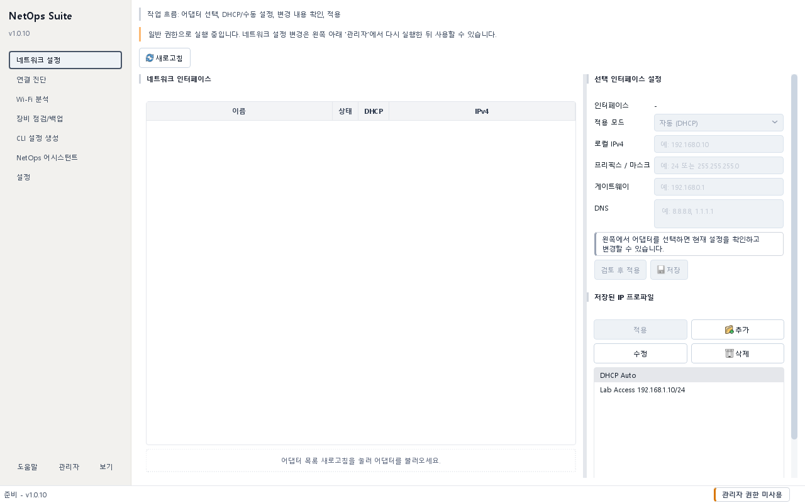

# 네트워크 설정 가이드

## 목적 {#interface}

Windows 네트워크 어댑터의 연결 상태, DHCP, IPv4, 프리픽스, 게이트웨이, DNS를 확인하고 승인된 어댑터에 DHCP 또는 수동 IPv4 설정을 적용합니다. 반복 사용하는 설정은 IP 프로파일로 저장해 다시 적용할 수 있습니다.

## 사전 준비 및 권한

- 어댑터 조회와 프로파일 작성은 일반 권한에서도 가능하지만, 시작 시 자동 조회와 설정 적용은 관리자 권한이 필요할 수 있습니다.
- 왼쪽 아래 `관리자`를 눌러 관리자 권한으로 다시 실행하면 앱이 새 프로세스로 열립니다. 실행 중 작업과 미저장 입력을 먼저 정리하세요.
- 원격 접속 중인 PC에서 IP·게이트웨이·DNS를 바꾸면 현재 세션이 즉시 끊길 수 있습니다.
- 적용 전 현재 설정과 복구용 DHCP 또는 정상 프로파일을 기록해 두세요.

## 입력 및 선택 사항

- `인터페이스`: 변경할 Windows 어댑터 한 개를 선택합니다.
- `적용 모드`: `자동 (DHCP)` 또는 `수동 IP`를 선택합니다.
- 수동 IP 입력:
  - `로컬 IPv4`: 예시 `192.0.2.10`
  - `프리픽스 / 마스크`: `24` 또는 `255.255.255.0`
  - `게이트웨이`: 선택 값, 예시 `192.0.2.1`
  - `DNS`: 쉼표 또는 줄바꿈으로 여러 IPv4 주소 입력
- IP 프로파일에는 이름, 적용 모드, 대상 인터페이스 이름, IPv4·프리픽스·게이트웨이·DNS를 저장할 수 있습니다.

## 사용 방법

### 현재 설정 조회

1. `네트워크 설정`을 엽니다.
2. `새로고침`을 눌러 어댑터 목록을 불러옵니다.
3. 표에서 이름, 설명, 상태, DHCP, IPv4, 프리픽스, 게이트웨이, DNS를 확인합니다.
4. 한 행을 선택하면 오른쪽 입력란에 현재 값이 채워집니다.

### DHCP 적용

1. 대상 어댑터를 선택합니다.
2. `적용 모드`를 `자동 (DHCP)`로 바꿉니다.
3. `검토 후 적용`을 누릅니다.
4. 확인 창의 현재 설정과 적용 후 `DHCP 할당`, `DNS 자동`을 비교합니다.
5. 대상이 맞으면 `설정 적용`을 승인합니다.

### 수동 IPv4 적용

1. 대상 어댑터를 선택하고 `수동 IP`를 선택합니다.
2. 조직의 주소 계획에 맞는 IPv4, 프리픽스/마스크, 게이트웨이, DNS를 입력합니다.
3. `검토 후 적용`을 누르고 현재 값과 적용 예정 값을 비교합니다.
4. 원격 연결 중단 가능성을 확인한 뒤 적용을 승인합니다.
5. 완료 후 자동 새로고침된 표에서 실제 값을 다시 확인합니다.

### IP 프로파일 관리

1. 어댑터와 입력값을 준비한 뒤 설정 영역의 `저장`을 눌러 이름을 지정합니다.
2. 새 프로파일은 `추가`, 기존 프로파일은 `수정`으로 관리합니다.
3. 저장된 프로파일과 대상 어댑터를 선택한 뒤 프로파일 영역의 `적용`을 누릅니다.
4. 삭제할 때는 복구가 자동 제공되지 않는다는 확인 창을 읽고 승인합니다.

## 성공 확인

- 어댑터 표의 DHCP, IPv4, 프리픽스, 게이트웨이, DNS가 적용한 값과 일치합니다.
- 하단 상태 표시줄에 성공 메시지가 표시되고 애플리케이션 로그에 작업 결과가 남습니다.
- DHCP 전환 후에는 Windows가 새 주소를 받을 때까지 잠시 기다린 뒤 다시 `새로고침`합니다.
- 수동 설정 후에는 `연결 진단`의 Ping과 DNS 조회로 게이트웨이·이름 해석을 별도로 확인합니다.

## 결과 및 저장 위치

- IP 프로파일은 현재 설정 폴더의 `ip_profiles.json`에 저장됩니다.
- 정확한 설정 폴더와 파일 경로는 `설정 > 저장 위치`와 `설정 > 설정 관리`에서 확인합니다.
- 설정 적용 결과는 하단 상태 표시줄과 현재 로그 폴더의 `app.log`에 기록됩니다.
- 어댑터의 실제 네트워크 설정은 Windows에 적용되며, 앱 설정 초기화로 자동 복원되지 않습니다.

## 주의사항

- 운영망에서 사용 중이거나 원격 접속에 쓰는 어댑터를 잘못 변경하면 복구를 위해 현장 접근이 필요할 수 있습니다.
- 게이트웨이는 일반적으로 로컬 IPv4와 같은 서브넷이어야 하며, 주소 충돌 여부를 먼저 확인해야 합니다.
- Wi-Fi와 유선처럼 여러 어댑터가 있을 때 이름과 설명을 함께 확인하세요.
- 프로파일 삭제는 Windows에 이미 적용된 설정을 되돌리지 않습니다.
- 예시 주소 `192.0.2.0/24`는 실제 통신용이 아닙니다. 적용 단계에서는 승인된 실환경 값만 사용하세요.

## 문제 해결

- 시작 시 목록이 비어 있고 일반 권한 안내가 나오면 관리자 권한으로 다시 실행하거나 `새로고침`을 수동으로 누릅니다.
- 적용 버튼이 비활성화되어 있으면 어댑터 선택과 관리자 권한 상태를 확인합니다.
- `입력 확인` 오류가 나오면 IPv4 형식, 프리픽스 범위, DNS 구분자를 확인합니다.
- 적용 후 통신이 끊기면 로컬 콘솔에서 DHCP 프로파일을 적용하거나 사전에 기록한 정상 값으로 되돌립니다.
- 적용 성공 메시지가 나왔지만 표가 다르면 잠시 기다린 후 다시 새로고침하고 Windows 네트워크 설정도 확인합니다.
