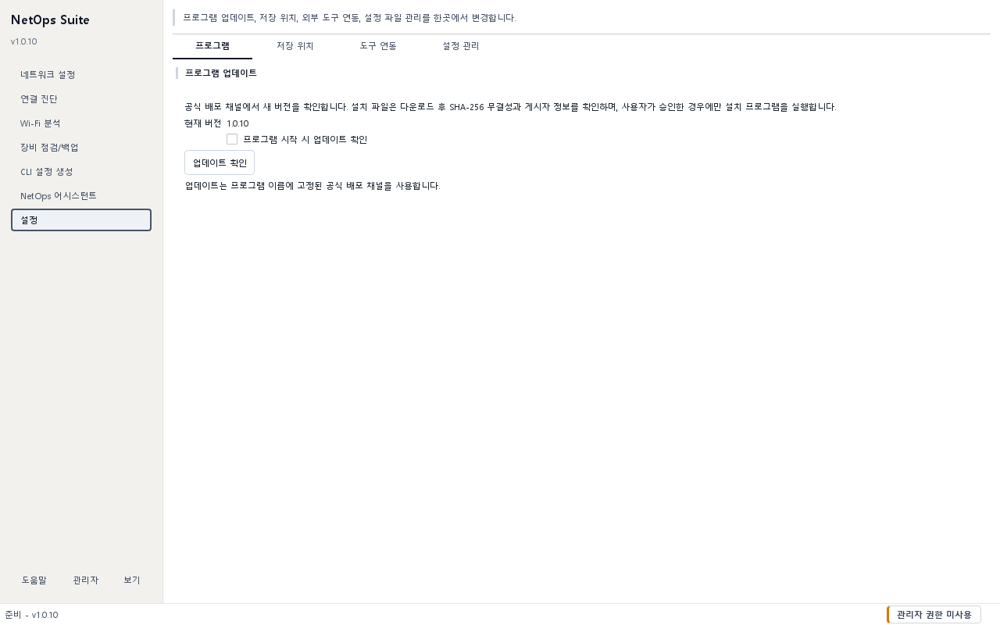

# 설정 가이드

## 목적 {#settings}

프로그램 업데이트, 설정·로그·결과 저장 위치, iperf3·OUI·Codex CLI 연동 상태와 설정 파일 초기화를 한 화면에서 관리합니다.

## 사전 준비 및 권한

- 경로를 바꾸기 전에 새 폴더의 읽기·쓰기 권한과 여유 공간을 확인합니다.
- 업데이트와 OUI 확인·갱신은 인터넷 연결과 조직의 외부 접근 정책이 필요합니다.
- iperf3 관리형 설치는 Windows `winget`이 있어야 합니다.
- AI CLI 경로에는 신뢰할 수 있는 실제 Codex 실행 파일만 지정합니다.
- `모든 설정 초기화`는 되돌리기 어려우므로 필요한 JSON·YAML 프로파일을 먼저 별도 백업합니다.

## 입력 및 선택 사항

- `프로그램`: 시작 시 업데이트 확인 여부
- `저장 위치`:
  - 설정 파일 폴더
  - 로그 폴더
  - 결과/내보내기 폴더
- `도구 연동`:
  - iperf3 실행 파일과 winget 설치 상태
  - IEEE OUI 데이터 버전과 원본
  - ChatGPT Codex CLI 실행 파일 경로와 설치 상태
- `설정 관리`: 설정 파일 다시 불러오기, 모든 설정 초기화

모든 사용자 지정 경로는 존재하는 절대 폴더를 사용합니다. 네트워크 공유 경로를 사용할 때는 오프라인·권한·민감 정보 노출 위험을 함께 검토하세요.

## 사용 방법

### 프로그램 업데이트

1. `프로그램` 탭에서 현재 버전을 확인합니다.
2. 필요하면 `프로그램 시작 시 업데이트 확인`을 선택합니다.
3. `업데이트 확인`을 눌러 앱에 고정된 공식 배포 채널을 조회합니다.
4. 새 버전이 있으면 릴리스 정보와 파일명을 확인하고 다운로드를 승인합니다.
5. SHA-256 검증 결과와 Windows 게시자·코드 서명을 확인합니다.
6. 설치 프로그램 실행을 승인하면 현재 앱이 종료되므로 실행 중 작업을 먼저 끝냅니다.

### 저장 위치 변경

1. `저장 위치` 탭에서 현재 경로를 확인합니다.
2. 각 항목의 `변경`으로 존재하는 대상 폴더를 선택하거나 절대 경로를 입력합니다.
3. `경로 설정 저장`을 누릅니다.
4. 설정 폴더가 바뀌면 기존 설정 파일을 새 폴더로 복사하되, 대상에 이미 있는 파일은 덮어쓰지 않습니다.
5. 설정 폴더와 결과/내보내기 폴더는 이후 작업에 바로 적용됩니다.
6. 로그 폴더 변경은 열린 로그 파일이 섞이지 않도록 앱을 다시 시작한 뒤 적용됩니다.
7. `현재 적용 중인 위치`와 각 `폴더 열기`로 실제 경로를 확인합니다.
8. 기본값으로 되돌리려면 `기본 경로로 되돌리기` 후 저장합니다.

### iperf3 관리

1. `도구 연동 > 전체 상태 새로고침`을 누릅니다.
2. 앱이 프로그램 폴더, winget 관리형 설치, 시스템 PATH 순서로 찾은 실행 경로와 버전을 확인합니다.
3. winget을 사용할 수 있고 설치 또는 업데이트가 필요할 때 표시되는 관리 버튼을 누릅니다.
4. 설치 로그와 최종 사용 경로를 확인합니다. 프로그램 폴더의 `iperf3.exe`가 있으면 winget 경로보다 우선할 수 있습니다.

### OUI 제조사 데이터

1. 로컬 데이터 버전, 건수와 원본이 `IEEE Registration Authority`인지 확인합니다.
2. `최신 여부 확인`으로 IEEE 공식 원본의 내용 버전과 비교합니다.
3. 업데이트가 필요하면 `데이터 업데이트`를 누릅니다. 앱은 필요한 공식 원본을 모두 받은 뒤 로컬 데이터를 교체합니다.
4. 완료 후 ARP, Wi-Fi, OUI 조회 화면을 다시 새로고침합니다.

### AI CLI 실행 파일

1. 먼저 경로를 비운 상태에서 `전체 상태 새로고침`으로 자동 감지를 사용합니다.
2. 자동 감지가 실패할 때만 `찾아보기`로 Codex의 실제 실행 파일을 선택합니다.
3. `AI CLI 경로 저장`을 누르고 상태를 다시 확인합니다.
4. 자동 감지로 돌아가려면 `자동 감지 사용`으로 입력을 비운 뒤 저장합니다.
5. Codex 로그인과 모델·응답 옵션은 `NetOps 어시스턴트 > 연결 설정`에서 관리합니다. 이미 설치된 실행 파일은 자동 업데이트하지 않습니다.
6. 실행 파일 감지 상태와 로그인 상태는 별개입니다. Codex CLI가 감지되어도 로그인이 필요할 수 있습니다.

### 설정 파일 다시 불러오기와 초기화

- 외부에서 승인된 설정 JSON을 수정한 경우 `설정 파일 다시 불러오기`로 현재 폴더의 값을 다시 읽습니다.
- `모든 설정 초기화`는 경고 내용을 확인하고 명시적으로 승인한 뒤 실행합니다. 초기화 후 앱 재시작이 필요합니다.

## 성공 확인

- 업데이트 화면에 현재 버전과 확인 결과가 표시됩니다.
- 경로 저장 후 `현재 적용 중인 위치`가 새 설정·결과 폴더를 표시하고 로그 폴더는 재시작 필요 여부를 안내합니다.
- 도구 상태에 iperf3 버전·사용 경로, OUI 데이터 버전과 Codex CLI 설치·감지 결과가 표시됩니다. Codex 로그인 상태는 `NetOps 어시스턴트 > 연결 설정`에서 별도로 확인합니다.
- 설정 다시 불러오기 후 프로파일과 화면 설정이 새 값으로 갱신됩니다.
- 초기화 후 기본 설정 파일이 다시 만들어지고 재시작 안내가 표시됩니다.

## 결과 및 저장 위치

- 사용자 지정 경로 설정 자체는 데이터 루트의 고정 `path_settings.json`에 저장됩니다.
- 기본 경로는 `%LOCALAPPDATA%\NetOps Suite\config`, `%LOCALAPPDATA%\NetOps Suite\logs`, `%LOCALAPPDATA%\NetOps Suite\logs\exports`입니다.
- 앱 주 설정, IP·FTP·SCP 프로파일, 런타임 상태와 캐시는 현재 설정 폴더에 저장됩니다.
- 앱 로그는 현재 적용 중인 로그 폴더의 `app.log`에 기록됩니다.
- 수동 저장 창에서 다른 경로를 선택하면 그 경로가 최종 결과 위치입니다.
- 모든 설정 초기화는 기존 애플리케이션 로그, 장비 점검 결과·백업과 사용자가 내보낸 파일을 삭제하지 않습니다.

## 주의사항

- 설정 폴더 이동 시 대상에 같은 이름 파일이 있으면 기존 대상 파일을 보존하고 복사를 건너뜁니다. 어떤 파일이 적용되는지 결과 메시지를 확인하세요.
- 로그 폴더는 재시작 전까지 이전 경로를 계속 사용할 수 있습니다.
- 네트워크 공유 또는 동기화 폴더는 자격 증명·프로파일·로그를 다른 사용자나 서비스에 노출할 수 있습니다.
- winget 설치는 외부 패키지를 내려받습니다. 패키지 ID와 조직 정책을 확인합니다.
- Codex 로그인 자격 정보와 인증 캐시는 공식 Codex CLI가 관리하며 NetOps Suite의 설정 파일에는 저장되지 않습니다.
- OUI 데이터 업데이트는 제조사 표시만 바꾸며 장비의 실제 MAC이나 네트워크 상태를 바꾸지 않습니다.
- `모든 설정 초기화`는 사용자 IP/FTP/SCP 프로파일, 화면·AI 설정, 사용자 장비 점검 규칙·파서를 기본값으로 되돌립니다.
- 초기화는 Windows에 이미 적용한 IP 설정이나 원격 장비의 상태를 되돌리지 않습니다.

## 문제 해결

- `경로 설정 저장 실패`는 절대 경로, 폴더 존재, 쓰기 권한과 잘못된 파일 경로 입력 여부를 확인합니다.
- 새 결과가 이전 폴더에 생기면 저장 대화상자에서 직접 선택한 경로인지, 기능이 결과/내보내기 폴더를 사용하는지 확인합니다.
- 새 로그 폴더가 비어 있으면 앱을 완전히 종료하고 다시 실행합니다.
- iperf3 설치 버튼을 사용할 수 없으면 winget 설치 여부와 조직 정책을 확인하고 승인된 실행 파일을 프로그램 폴더 또는 PATH에 배치합니다.
- OUI 최신 확인·업데이트가 실패하면 인터넷, 프록시, 인증서 검사와 IEEE 원본 접근을 확인합니다.
- Codex CLI를 찾지 못하면 조직이 승인한 공식 방법으로 설치하고, 선택한 파일이 실제 실행 파일인지 확인한 뒤 자동 감지 또는 절대 경로를 다시 저장합니다.
- 초기화 후 예전 설정이 보이면 앱을 재시작하고 `현재 적용 중인 위치`가 기본 폴더인지 확인합니다.
