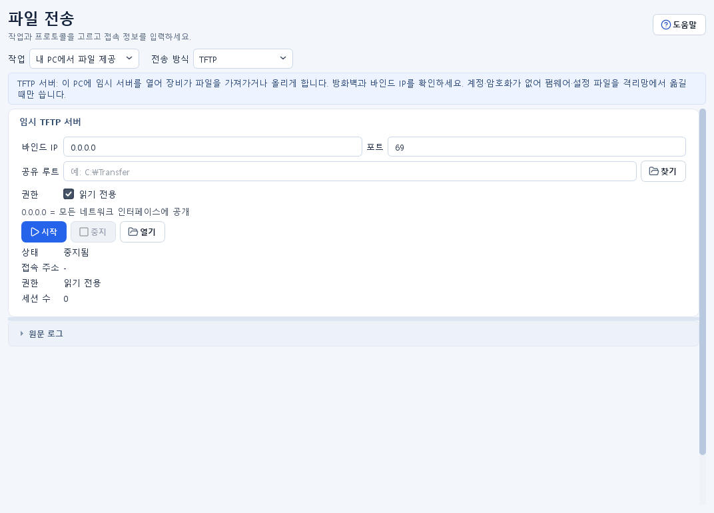

# 파일 전송 및 임시 서버 가이드

## 목적 {#transfer}

FTP, FTPS, SFTP, SCP, TFTP로 파일을 업로드·다운로드하거나 이 PC에서 임시 서버를 열어 장비가 파일을 주고받게 합니다. `파일 전송`에서 `작업`과 `전송 방식`을 선택하면 해당 화면으로 전환됩니다. 선택 아래 안내 줄에 지금 고른 방식이 무엇을 하는지와 언제 쓰는지(예: 암호화가 필요하면 SFTP·FTPS, TFTP는 격리망 전용)가 표시됩니다.

## 사전 준비 및 권한

- 접속 대상, 포트, 계정, 공유 폴더와 전송 방향을 담당자에게 확인합니다.
- 로컬·원격 방화벽에서 필요한 포트와 데이터 연결이 허용되어야 합니다.
- 임시 서버는 존재하는 공유 루트 폴더가 필요합니다. 읽기/쓰기 권한을 최소화하세요.
- SFTP·SCP 기능은 패키지에 포함된 Paramiko 런타임이 정상이어야 합니다. 화면의 지원 상태를 먼저 확인합니다.
- 낮은 포트나 방화벽 규칙 변경에는 관리자 승인이 필요할 수 있습니다. 앱은 방화벽 규칙을 자동으로 만들지 않습니다.
- 실제 비밀번호는 예제 파일이나 문서에 기록하지 말고 세션 입력란에만 입력합니다.

## 입력 및 선택 사항

| 방식 | 기본 클라이언트 포트 | 기본 임시 서버 포트 | 보호 특성 |
| --- | ---: | ---: | --- |
| FTP | 21 | 2121 | 암호화 없음 |
| FTPS | 21 | 2121 | FTP over TLS |
| SFTP | 22 | 2222 | SSH 기반 |
| SCP | 22 | 2223 | SSH 기반 파일 복사 |
| TFTP | 69 | 69 | 인증·암호화 없음 |

- `바인드 IP`를 비우면 기본적으로 `0.0.0.0`을 사용해 모든 IPv4 인터페이스에서 수신합니다.
- FTP 계열 클라이언트 프로파일은 프로토콜, 호스트, 포트, 사용자명, 원격 경로, 패시브 모드, Timeout을 저장하지만 비밀번호는 저장하지 않습니다.
- SCP 프로파일도 연결 정보와 경로를 저장하고 비밀번호는 세션에서 입력합니다.
- 다운로드 `로컬 폴더`와 서버 `공유 루트`는 서로 다른 개념입니다. 다운로드 대상 폴더와 외부에 공개할 폴더를 각각 확인하세요.

## 사용 방법

기본 화면에서는 대상·계정·경로와 전송 동작을 확인합니다. 재사용할 접속 정보는 `저장된 접속 프로파일`, 포트·Timeout·패시브 모드·재시도는 `연결 옵션`을 펼쳐 입력합니다. `원문 로그`는 필요할 때 펼칩니다. 접어도 입력값은 유지됩니다.

### FTP 클라이언트 {#ftp-client}

1. `작업: 파일 보내기·받기`, `전송 방식: FTP/FTPS/SFTP`, `프로토콜: FTP`를 선택합니다.
2. 호스트, 포트, 사용자명, 비밀번호, Timeout, 원격 경로, 로컬 폴더를 입력합니다. 사용자명을 비우면 FTP는 `anonymous`를 사용할 수 있습니다.
3. NAT·방화벽 환경에서는 기본 `패시브 모드`를 우선 사용합니다.
4. `연결` 후 원격 목록을 확인합니다.
5. 업로드할 로컬 파일을 선택하거나, 원격 파일을 선택해 `다운로드`합니다.
6. 연결 후 `원격 파일 관리`를 펼칩니다. 권한이 있을 때만 원격 `폴더`, `이름`, `삭제` 작업을 사용합니다. 이름 변경과 삭제는 확인 창을 다시 읽습니다.
7. 작업 후 `종료`로 세션을 닫습니다.

FTP는 계정, 명령, 파일 내용이 암호화되지 않습니다. 격리된 신뢰 네트워크의 호환 장비에만 사용하세요.

### FTPS 클라이언트 {#ftps-client}

FTP 클라이언트 절차에서 `프로토콜: FTPS`를 선택합니다. 로그인 후 보호된 데이터 연결을 사용합니다. 서버 인증서가 자체 서명되었거나 조직 신뢰 저장소와 맞지 않으면 연결 정책을 담당자와 확인하세요. 단순히 연결됐다는 이유만으로 서버 신원을 확정하지 마세요.

### SFTP 클라이언트 {#sftp-client}

FTP 클라이언트 절차에서 `프로토콜: SFTP`를 선택합니다. 사용자명은 필수이며 패시브 모드는 사용하지 않습니다. 연결 후 표시되는 SSH 서버 키 지문을 신뢰 가능한 별도 경로로 받은 값과 비교하고, 예상과 다르면 파일 전송을 중단합니다.

### FTP 임시 서버 {#ftp-server}

1. `작업: 내 PC에서 파일 제공`, `전송 방식: FTP/FTPS/SFTP`, `프로토콜: FTP`를 선택합니다.
2. 가능하면 `0.0.0.0` 대신 접속을 허용할 로컬 인터페이스 IP를 입력합니다.
3. 포트, 존재하는 공유 루트, 임시 계정과 강한 임시 비밀번호를 입력합니다.
4. 기본은 `읽기 전용`을 권장합니다. 익명 접속이 꼭 필요하면 `읽기 전용`과 `익명 읽기 전용 허용`을 함께 사용합니다.
5. `시작`을 누르고 공개 범위·루트·권한 확인 창을 승인합니다.
6. 실행 상태, 엔드포인트, 세션 수와 서버 로그를 확인합니다.
7. 작업이 끝나면 `중지`하고 더 이상 필요 없는 임시 파일과 계정을 정리합니다.

FTP 서버는 전송 내용을 암호화하지 않습니다. 조직의 격리된 관리망과 짧은 작업 시간에만 사용하세요.

### FTPS 임시 서버 {#ftps-server}

FTP 임시 서버 절차에서 `프로토콜: FTPS`를 선택합니다. 앱은 로컬 FTPS 인증서와 개인 키가 없으면 설정 폴더의 FTP 키 디렉터리에 장기 자체 서명 인증서를 생성합니다. 화면의 SHA-256 인증서 지문을 클라이언트 담당자에게 신뢰 가능한 경로로 전달해 비교하게 하세요. 개인 키 파일이 노출되면 해당 키 파일을 안전하게 교체하고 기존 지문을 더 이상 신뢰하지 않아야 합니다.

### SFTP 임시 서버 {#sftp-server}

FTP 임시 서버 절차에서 `프로토콜: SFTP`를 선택합니다. 익명 접속은 지원하지 않으며 계정과 비밀번호가 필요합니다. 앱이 생성·보관하는 SFTP 호스트 키의 지문을 클라이언트에서 확인하세요. 클라이언트가 예고 없이 새 지문을 보게 되면 연결을 중단하고 서버 키 변경 원인을 확인합니다.

### SCP 클라이언트 {#scp-client}

1. `작업: 파일 보내기·받기`, `전송 방식: SCP`를 선택합니다.
2. 호스트, 포트, 사용자명, 비밀번호, Timeout을 입력합니다.
3. 업로드는 `업로드 대상` 원격 경로와 로컬 파일을 선택한 뒤 `업로드`합니다.
4. 다운로드는 `다운로드 원격 경로`에 한 줄에 하나씩 경로를 입력하고 로컬 폴더를 선택한 뒤 `다운로드`합니다.
5. 결과 표의 출발지·대상·크기·상태와 실시간 로그를 확인합니다.
6. 표시된 SSH 호스트 키 지문이 승인된 서버 값과 일치하는지 확인합니다.

SCP 클라이언트는 처음 보는 호스트 키를 자동 수용해 연결한 뒤 지문을 표시하므로, 지문을 별도 경로로 대조하지 않으면 중간자 공격을 탐지할 수 없습니다.

### SCP 임시 서버 {#scp-server}

1. `작업: 내 PC에서 파일 제공`, `전송 방식: SCP`를 선택합니다.
2. 바인드 IP, 포트(기본 2223), 공유 루트, 계정, 비밀번호, `읽기/쓰기` 또는 `읽기 전용`을 입력합니다.
3. 공개 범위와 권한 확인 창을 승인해 시작합니다.
4. 엔드포인트, 세션 수, 서버 키 지문과 전송 로그를 확인합니다.
5. 클라이언트 담당자가 최초 접속 전에 서버 지문을 비교할 수 있게 전달합니다.
6. 완료 즉시 `중지`합니다.

내장 서버는 임시 SCP 전송을 위한 제한된 서버이며 일반 SSH 셸 서버가 아닙니다.

### TFTP 클라이언트 {#tftp-client}

1. `작업: 파일 보내기·받기`, `전송 방식: TFTP`를 선택합니다.
2. 호스트, 포트(기본 69), Timeout(기본 5초), 재시도(기본 3)를 입력합니다.
3. 업로드는 원격 경로와 로컬 파일을 지정해 `업로드`합니다.
4. 다운로드는 원격 경로와 로컬 폴더를 지정해 `다운로드`합니다.
5. 결과와 실시간 로그를 확인하고 반복 실패 시 경로·권한·방화벽·서버 모드를 점검합니다.

### TFTP 임시 서버 {#tftp-server}

1. `작업: 내 PC에서 파일 제공`, `전송 방식: TFTP`를 선택합니다.
2. 바인드 IP, 포트, 공유 루트와 읽기 전용 여부를 선택합니다.
3. 영향 확인 창을 승인하고 `시작`합니다.
4. 엔드포인트, 접근 모드, 세션 수와 로그를 확인합니다.
5. 필요한 전송이 끝나면 `중지`합니다.

TFTP는 계정·서버 신원 확인·암호화를 제공하지 않습니다. 신뢰할 수 있는 격리망에서 최소 시간만 열고, 가능한 경우 읽기 전용을 사용하세요.

## 성공 확인

- FTP/FTPS/SFTP는 `연결 완료` 상태와 원격 폴더 목록이 표시됩니다.
- SCP/TFTP는 각 파일이 결과 표에 추가되고 상태가 성공으로 표시됩니다.
- 다운로드 파일은 선택한 로컬 폴더에서 크기와 내용을 확인할 수 있습니다.
- 임시 서버는 `실행 중`, 실제 엔드포인트와 세션 수를 표시하며 접속·전송 이벤트가 로그에 나타납니다.
- FTPS/SFTP/SCP는 표시된 인증서 또는 호스트 키 지문을 사전에 전달받은 값과 비교해야 신원 확인이 완료됩니다.

## 결과 및 저장 위치

- 다운로드 파일은 사용자가 선택한 `로컬 폴더`에 저장됩니다.
- 업로드 파일은 서버가 허용한 원격 경로 또는 임시 서버 공유 루트 아래에 저장됩니다.
- 클라이언트 전송 결과는 `CSV 저장`, 클라이언트·서버 로그는 `로그 저장`으로 내보낼 수 있습니다.
- 저장 대화상자의 기본 제안 위치는 현재 결과/내보내기 폴더이며 최종 경로는 사용자가 선택합니다.
- FTP·SCP 연결 프로파일과 마지막 화면 입력 상태는 현재 설정 폴더에 저장됩니다. 비밀번호는 프로파일과 런타임 상태에 저장하지 않습니다.
- 임시 FTPS 인증서·키와 SFTP/SCP 호스트 키는 현재 설정 폴더의 FTP 키 디렉터리에 저장될 수 있습니다.

## 주의사항

- 업로드·다운로드는 기존 파일을 덮어쓸 수 있습니다. 원본과 대상 경로, 서버의 덮어쓰기 정책을 먼저 확인하세요.
- 원격 파일 삭제와 이름 변경은 되돌리기 어려울 수 있습니다.
- 읽기/쓰기 서버는 외부 접속자가 공유 루트 안의 파일을 만들거나 바꿀 수 있게 합니다.
- `0.0.0.0` 바인드는 유선, Wi-Fi, VPN 등 모든 IPv4 인터페이스에 노출될 수 있습니다.
- 로그와 CSV에는 호스트, 사용자명, 로컬·원격 경로와 파일명이 포함됩니다.
- TFTP와 FTP는 민감한 파일과 자격 증명 전송에 사용하지 마세요.
- 자체 서명 인증서 또는 앱이 처음 생성한 호스트 키는 지문을 별도 경로로 검증해야 합니다.

## 문제 해결

- `사용 준비` 오류가 보이면 패키지 설치가 손상됐는지 확인하고 공식 설치본을 복구하거나 개발 의존성을 다시 설치합니다.
- 연결 시간 초과는 호스트·포트·라우팅·방화벽·서버 대기 주소를 확인합니다.
- FTP 목록 또는 데이터 전송만 실패하면 패시브 모드와 서버의 데이터 포트 정책을 확인합니다.
- SFTP/SCP 인증 실패는 사용자명·비밀번호와 서버 SSH 정책을 확인합니다. 지문 불일치를 무시하지 마세요.
- 서버가 시작되지 않으면 포트가 이미 사용 중인지, 공유 루트가 존재하는지, 현재 계정이 폴더를 읽고 쓸 수 있는지 확인합니다.
- TFTP가 반복 시간 초과되면 UDP 69와 응답 UDP 흐름, 원격 경로 철자, 서버 읽기/쓰기 모드를 확인합니다.
- 저장 결과가 없으면 결과 행 또는 로그가 실제로 생성됐는지 확인한 뒤 다시 내보냅니다.

## 파일 전송 빠른 안내 {#quick-diagnostics-transfer}

이 PC와 장비 사이에 파일을 보내거나 받습니다.

**준비**: 대상 주소·전송 방식·계정과 파일 경로를 준비합니다.

1. 작업에서 파일 보내기·받기 또는 내 PC에서 파일 제공을 선택합니다.
2. 장비가 지원하는 전송 방식을 선택합니다.
3. 경로와 권한을 확인한 뒤 전송하거나 서버를 시작합니다.

**성공 확인**: 파일별 성공 상태와 대상 파일을 확인할 수 있습니다.

**안 되면**: 실패하면 주소·포트·경로·권한을 확인하고 작업 후 연결이나 임시 서버를 종료합니다.

## FTP 클라이언트 빠른 안내 {#quick-diagnostics-transfer-ftp-client}

FTP로 장비에 파일을 보내거나 받습니다.

**준비**: 호스트·포트·경로와 계정을 준비합니다. 암호화되지 않으므로 격리된 승인 네트워크에서만 사용하세요.

1. 작업에서 파일 보내기·받기를 선택합니다.
2. 전송 방식은 FTP/FTPS/SFTP, 프로토콜은 FTP를 고릅니다.
3. 대상·계정·경로를 입력하고 연결을 누릅니다. 포트 등은 연결 옵션에서 바꿉니다.
4. 연결 후 파일을 선택해 업로드 또는 다운로드합니다.
5. 대상 파일을 확인하고 종료로 연결을 닫습니다.

**성공 확인**: 파일 전송이 성공하고 대상 위치의 파일을 확인할 수 있습니다.

**안 되면**: 업로드·다운로드가 비활성화되어 있으면 먼저 연결합니다. 연결 실패 시 주소·포트·계정·권한을 확인합니다. 기존 파일 덮어쓰기에 주의하세요.

## FTP 임시 서버 빠른 안내 {#quick-diagnostics-transfer-ftp-server}

이 PC에서 임시 FTP 서버를 엽니다.

**준비**: 공유할 폴더와 허용할 인터페이스·권한을 준비합니다. 암호화되지 않으므로 격리된 승인 네트워크에서만 사용하세요.

1. 작업은 내 PC에서 파일 제공, 전송 방식은 FTP/FTPS/SFTP를 선택합니다. 프로토콜은 FTP를 고릅니다.
2. 공유 루트·바인드 IP·포트·임시 계정과 비밀번호·접근 권한을 확인합니다.
3. 공개 범위 확인 후 시작합니다.
4. 필요한 전송을 마치면 즉시 중지합니다.

**성공 확인**: 실행 상태와 접속 주소가 표시되고 전송 로그를 확인할 수 있습니다.

**안 되면**: 시작 실패 시 포트 사용 여부와 폴더 권한을 확인합니다. 0.0.0.0은 모든 IPv4 인터페이스에 공개됩니다.

## FTPS 클라이언트 빠른 안내 {#quick-diagnostics-transfer-ftps-client}

FTPS로 장비에 파일을 보내거나 받습니다.

**준비**: 호스트·포트·경로와 계정을 준비합니다. 서버 지문을 승인된 값과 비교하세요.

1. 작업에서 파일 보내기·받기를 선택합니다.
2. 전송 방식은 FTP/FTPS/SFTP, 프로토콜은 FTPS를 고릅니다.
3. 대상·계정·경로를 입력하고 연결을 누릅니다. 포트 등은 연결 옵션에서 바꿉니다.
4. 연결 후 파일을 선택해 업로드 또는 다운로드합니다.
5. 대상 파일을 확인하고 종료로 연결을 닫습니다.

**성공 확인**: 파일 전송이 성공하고 대상 위치의 파일을 확인할 수 있습니다.

**안 되면**: 업로드·다운로드가 비활성화되어 있으면 먼저 연결합니다. 연결 실패 시 주소·포트·계정·권한을 확인합니다. 기존 파일 덮어쓰기에 주의하세요.

## FTPS 임시 서버 빠른 안내 {#quick-diagnostics-transfer-ftps-server}

이 PC에서 임시 FTPS 서버를 엽니다.

**준비**: 공유할 폴더와 허용할 인터페이스·권한을 준비합니다. 서버 지문을 접속 담당자에게 전달해 비교하도록 합니다.

1. 작업은 내 PC에서 파일 제공, 전송 방식은 FTP/FTPS/SFTP를 선택합니다. 프로토콜은 FTPS를 고릅니다.
2. 공유 루트·바인드 IP·포트·임시 계정과 비밀번호·접근 권한을 확인합니다.
3. 공개 범위 확인 후 시작합니다.
4. 필요한 전송을 마치면 즉시 중지합니다.

**성공 확인**: 실행 상태와 접속 주소가 표시되고 전송 로그를 확인할 수 있습니다.

**안 되면**: 시작 실패 시 포트 사용 여부와 폴더 권한을 확인합니다. 0.0.0.0은 모든 IPv4 인터페이스에 공개됩니다.

## SFTP 클라이언트 빠른 안내 {#quick-diagnostics-transfer-sftp-client}

SFTP로 장비에 파일을 보내거나 받습니다.

**준비**: 호스트·포트·경로와 계정을 준비합니다. 서버 지문을 승인된 값과 비교하세요.

1. 작업에서 파일 보내기·받기를 선택합니다.
2. 전송 방식은 FTP/FTPS/SFTP, 프로토콜은 SFTP를 고릅니다.
3. 대상·계정·경로를 입력하고 연결을 누릅니다. 포트 등은 연결 옵션에서 바꿉니다.
4. 연결 후 파일을 선택해 업로드 또는 다운로드합니다.
5. 대상 파일을 확인하고 종료로 연결을 닫습니다.

**성공 확인**: 파일 전송이 성공하고 대상 위치의 파일을 확인할 수 있습니다.

**안 되면**: 업로드·다운로드가 비활성화되어 있으면 먼저 연결합니다. 연결 실패 시 주소·포트·계정·권한을 확인합니다. 기존 파일 덮어쓰기에 주의하세요.

## SFTP 임시 서버 빠른 안내 {#quick-diagnostics-transfer-sftp-server}

이 PC에서 임시 SFTP 서버를 엽니다.

**준비**: 공유할 폴더와 허용할 인터페이스·권한을 준비합니다. 서버 지문을 접속 담당자에게 전달해 비교하도록 합니다.

1. 작업은 내 PC에서 파일 제공, 전송 방식은 FTP/FTPS/SFTP를 선택합니다. 프로토콜은 SFTP를 고릅니다.
2. 공유 루트·바인드 IP·포트·임시 계정과 비밀번호·접근 권한을 확인합니다.
3. 공개 범위 확인 후 시작합니다.
4. 필요한 전송을 마치면 즉시 중지합니다.

**성공 확인**: 실행 상태와 접속 주소가 표시되고 전송 로그를 확인할 수 있습니다.

**안 되면**: 시작 실패 시 포트 사용 여부와 폴더 권한을 확인합니다. 0.0.0.0은 모든 IPv4 인터페이스에 공개됩니다.

## SCP 클라이언트 빠른 안내 {#quick-diagnostics-transfer-scp-client}

SCP로 장비에 파일을 보내거나 받습니다.

**준비**: 호스트·포트·경로와 계정을 준비합니다. 서버 지문을 승인된 값과 비교하세요.

1. 작업에서 파일 보내기·받기와 SCP 방식을 선택합니다.
2. 대상과 로컬·원격 경로를 입력합니다.
3. 전송 방향을 확인하고 업로드 또는 다운로드합니다.
4. 파일별 상태와 실제 대상 파일을 확인합니다.

**성공 확인**: 파일 전송이 성공하고 대상 위치의 파일을 확인할 수 있습니다.

**안 되면**: 실패하면 주소·포트·경로·계정 또는 폴더 권한을 확인합니다. 기존 파일 덮어쓰기에 주의하세요.

## SCP 임시 서버 빠른 안내 {#quick-diagnostics-transfer-scp-server}

이 PC에서 임시 SCP 서버를 엽니다.

**준비**: 공유할 폴더와 허용할 인터페이스·권한을 준비합니다. 서버 지문을 접속 담당자에게 전달해 비교하도록 합니다.

1. 작업은 내 PC에서 파일 제공, 전송 방식은 SCP를 선택합니다.
2. 공유 루트·바인드 IP·포트·임시 계정과 비밀번호·접근 권한을 확인합니다.
3. 공개 범위 확인 후 시작합니다.
4. 필요한 전송을 마치면 즉시 중지합니다.

**성공 확인**: 실행 상태와 접속 주소가 표시되고 전송 로그를 확인할 수 있습니다.

**안 되면**: 시작 실패 시 포트 사용 여부와 폴더 권한을 확인합니다. 0.0.0.0은 모든 IPv4 인터페이스에 공개됩니다.

## TFTP 클라이언트 빠른 안내 {#quick-diagnostics-transfer-tftp-client}

TFTP로 장비에 파일을 보내거나 받습니다.

**준비**: 호스트·포트·경로를 준비합니다. 암호화되지 않으므로 격리된 승인 네트워크에서만 사용하세요.

1. 작업에서 파일 보내기·받기와 TFTP 방식을 선택합니다.
2. 대상과 로컬·원격 경로를 입력합니다.
3. 전송 방향을 확인하고 업로드 또는 다운로드합니다.
4. 파일별 상태와 실제 대상 파일을 확인합니다.

**성공 확인**: 파일 전송이 성공하고 대상 위치의 파일을 확인할 수 있습니다.

**안 되면**: 실패하면 주소·포트·경로와 폴더 권한을 확인합니다. 기존 파일 덮어쓰기에 주의하세요.

## TFTP 임시 서버 빠른 안내 {#quick-diagnostics-transfer-tftp-server}

이 PC에서 임시 TFTP 서버를 엽니다.

**준비**: 공유할 폴더와 허용할 인터페이스·권한을 준비합니다. 암호화되지 않으므로 격리된 승인 네트워크에서만 사용하세요.

1. 작업은 내 PC에서 파일 제공, 전송 방식은 TFTP를 선택합니다.
2. 공유 루트·바인드 IP·포트와 권한을 확인합니다.
3. 공개 범위 확인 후 시작합니다.
4. 필요한 전송을 마치면 즉시 중지합니다.

**성공 확인**: 실행 상태와 접속 주소가 표시되고 전송 로그를 확인할 수 있습니다.

**안 되면**: 시작 실패 시 포트 사용 여부와 폴더 권한을 확인합니다. 0.0.0.0은 모든 IPv4 인터페이스에 공개됩니다.
