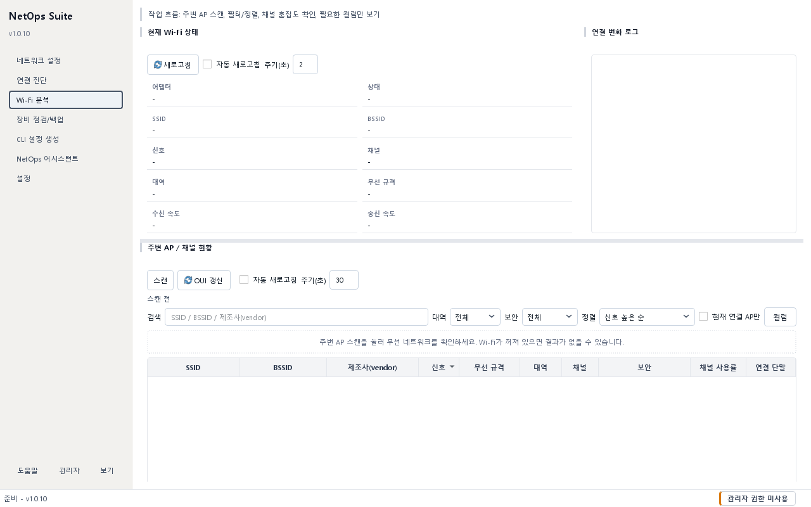

# Wi-Fi 분석 가이드

## 목적 {#wireless}

현재 Wi-Fi 연결 상태와 주변 AP를 조회해 신호, 대역, 채널, 보안, 채널 사용률, 제조사 정보를 비교합니다. 이 화면은 무선 설정을 변경하지 않으며 현장 조사와 문제 범위 축소에 사용합니다.

## 사전 준비 및 권한

- Windows Wi-Fi 어댑터와 무선 서비스가 켜져 있어야 합니다.
- 일반 권한에서 대부분 사용할 수 있지만 조직 정책이나 드라이버가 주변 AP 세부 정보를 제한할 수 있습니다.
- 주변 AP 스캔은 로컬 Wi-Fi 하드웨어와 Windows 명령 출력에 의존합니다.
- 제조사 표시와 `OUI 갱신`에는 로컬 OUI 데이터가 필요하며 갱신 시 외부 IEEE 원본에 접속합니다.

## 입력 및 선택 사항

- 현재 상태 자동 새로고침 주기는 1~30초입니다.
- 주변 AP 자동 새로고침 주기는 5~300초입니다.
- 검색은 SSID, BSSID, 제조사 문자열을 대상으로 합니다.
- 대역 필터는 전체, 2.4GHz, 5GHz, 6GHz입니다.
- 보안 필터는 전체, 보안 사용, 개방형입니다.
- 정렬은 신호, 채널, 채널 사용률, SSID, 제조사를 기준으로 선택할 수 있습니다.
- `현재 연결 AP만`과 `컬럼` 메뉴로 표시 범위를 좁힐 수 있습니다.

## 사용 방법

1. `Wi-Fi 분석`을 엽니다.
2. `현재 Wi-Fi 상태 > 새로고침`을 눌러 어댑터, 상태, SSID, BSSID, 신호, 채널, 대역, 무선 규격, 송수신 속도를 확인합니다.
3. 연결 변화를 관찰하려면 `자동 새로고침`과 주기를 선택합니다. SSID·BSSID·신호 같은 값의 변화는 오른쪽 `연결 변화 로그`에 기록됩니다.
4. `주변 AP / 채널 현황 > 스캔`을 누릅니다.
5. 검색, 대역, 보안, 정렬, 현재 연결 AP 필터를 조합해 표를 좁힙니다.
6. `컬럼` 메뉴에서 필요한 항목만 남깁니다. 최소 한 개 컬럼은 항상 표시됩니다.
7. 요약에서 표시/전체 AP 수, 현재 연결 채널, 대역별 수와 주요 혼잡 채널을 확인합니다.
8. 제조사가 없거나 오래된 경우 `OUI 갱신` 후 다시 스캔합니다.

## 성공 확인

- 현재 연결 중이면 SSID와 BSSID가 표시되고 상태가 연결됨으로 나타납니다.
- 주변 AP 표에 SSID, BSSID, 제조사, 신호, 규격, 대역, 채널, 보안 정보가 표시됩니다.
- 현재 연결 AP는 강조 표시되고 정렬을 바꿔도 우선 식별할 수 있습니다.
- 필터를 적용하면 요약의 `표시 n / 전체 m` 수가 표 행 수와 일치합니다.
- 자동 새로고침을 켜면 선택한 주기마다 완료 시각 또는 표 내용이 갱신됩니다.

## 결과 및 저장 위치

- 현재 Wi-Fi 상태, 주변 AP 목록과 연결 변화 로그는 기본적으로 화면에만 표시되며 자동 내보내기 파일을 만들지 않습니다.
- 자동 새로고침 주기, 검색·필터·정렬, 숨긴 컬럼과 화면 분할 상태는 앱 UI 상태에 저장될 수 있습니다.
- OUI 데이터 캐시는 현재 설정 폴더에 저장되며 `설정 > 도구 연동`에서 버전과 원본을 확인할 수 있습니다.
- 앱 동작 오류는 현재 로그 폴더의 `app.log`에 기록됩니다.

## 주의사항

- 신호 백분율과 링크 속도는 순간값이며 실제 애플리케이션 처리량과 같지 않습니다.
- 채널 사용률과 연결 단말 수는 AP·드라이버가 제공하지 않으면 `-`로 표시될 수 있습니다.
- 숨김 SSID, 다중 BSSID, 메쉬 AP는 같은 네트워크가 여러 행으로 보이거나 SSID가 비어 보일 수 있습니다.
- OUI 제조사는 MAC 접두어 등록 정보이며 실제 장비 브랜드나 운영 주체를 확정하지 않습니다. 임의 MAC은 조회되지 않을 수 있습니다.
- 짧은 자동 새로고침 주기는 무선 드라이버와 시스템에 불필요한 부하를 줄 수 있습니다.
- 주변 무선 네트워크의 존재와 식별 정보를 승인되지 않은 위치에 공유하지 마세요.

## 문제 해결

- 현재 상태가 비어 있으면 Wi-Fi가 켜져 있는지, 비행기 모드인지, 어댑터 드라이버와 Windows WLAN 서비스가 정상인지 확인합니다.
- 주변 AP가 0개면 잠시 기다려 다시 스캔하고, 필터를 `전체`로 되돌립니다.
- 표는 있지만 찾는 AP가 없으면 검색 텍스트와 `현재 연결 AP만`을 해제합니다.
- 제조사만 비어 있으면 `OUI 갱신` 후 다시 스캔합니다. 갱신 실패 시 인터넷·프록시·IEEE 원본 접근 정책을 확인합니다.
- 자동 새로고침 중 오류가 반복되면 자동 모드를 끄고 한 번씩 수동 조회해 드라이버 상태를 확인합니다.
